# Coze Studio 数据库 UML 图

本文档包含 Coze Studio 项目的完整数据库 ER 图，展示所有表及其关系。

## 数据库概览

- **总表数**: 55 个表
- **主要业务域**: 用户/空间、App、Agent、Workflow、Plugin、Knowledge、Database、Conversation、Model 等

## 完整 ER 图（按业务域分组）

```mermaid
graph TB
    subgraph UserSpace["用户与空间域 User & Space"]
        user["<b>user</b><br/>用户表<br/>---<br/>+ id: bigint PK<br/>+ name: varchar<br/>+ unique_name: varchar UK<br/>+ email: varchar UK<br/>+ session_key: varchar"]
        space["<b>space</b><br/>空间表<br/>---<br/>+ id: bigint PK<br/>+ owner_id: bigint FK<br/>+ name: varchar<br/>+ creator_id: bigint FK"]
        space_user["<b>space_user</b><br/>空间成员表<br/>---<br/>+ id: bigint PK<br/>+ space_id: bigint FK<br/>+ user_id: bigint FK<br/>+ role_type: int"]
        api_key["<b>api_key</b><br/>API密钥表<br/>---<br/>+ id: bigint PK<br/>+ user_id: bigint FK<br/>+ api_key: varchar<br/>+ status: tinyint"]
    end

    subgraph AppDomain["应用域 Application"]
        app_draft["<b>app_draft</b><br/>应用草稿表<br/>---<br/>+ id: bigint PK<br/>+ space_id: bigint FK<br/>+ owner_id: bigint FK<br/>+ name: varchar"]
        app_release_record["<b>app_release_record</b><br/>发布记录表<br/>---<br/>+ id: bigint PK<br/>+ app_id: bigint FK<br/>+ version: varchar<br/>+ publish_status: tinyint"]
        app_connector_release_ref["<b>app_connector_release_ref</b><br/>连接器发布引用<br/>---<br/>+ id: bigint PK<br/>+ record_id: bigint FK<br/>+ connector_id: bigint FK"]
        app_conversation_template_draft["<b>app_conversation_template_draft</b><br/>会话模板草稿<br/>---<br/>+ id: bigint PK<br/>+ app_id: bigint FK<br/>+ template_id: bigint FK"]
        app_dynamic_conversation_draft["<b>app_dynamic_conversation_draft</b><br/>动态会话草稿<br/>---<br/>+ id: bigint PK<br/>+ app_id: bigint FK<br/>+ conversation_id: bigint FK"]
    end

    subgraph AgentDomain["Agent域 Agent"]
        single_agent_draft["<b>single_agent_draft</b><br/>Agent草稿表<br/>---<br/>+ id: bigint PK<br/>+ agent_id: bigint UK<br/>+ space_id: bigint FK<br/>+ creator_id: bigint FK<br/>+ model_info: json<br/>+ prompt: json"]
        single_agent_version["<b>single_agent_version</b><br/>Agent版本表<br/>---<br/>+ id: bigint PK<br/>+ agent_id: bigint FK<br/>+ version: varchar<br/>+ connector_id: bigint FK"]
        single_agent_publish["<b>single_agent_publish</b><br/>Agent发布表<br/>---<br/>+ id: bigint PK<br/>+ agent_id: bigint FK<br/>+ publish_id: varchar<br/>+ version: varchar"]
        agent_tool_draft["<b>agent_tool_draft</b><br/>Agent工具草稿<br/>---<br/>+ id: bigint PK<br/>+ agent_id: bigint FK<br/>+ plugin_id: bigint FK<br/>+ tool_id: bigint FK"]
        agent_to_database["<b>agent_to_database</b><br/>Agent数据库关联<br/>---<br/>+ id: bigint PK<br/>+ agent_id: bigint FK<br/>+ database_id: bigint FK<br/>+ is_draft: bool"]
    end

    subgraph WorkflowDomain["工作流域 Workflow"]
        workflow_meta["<b>workflow_meta</b><br/>工作流元数据<br/>---<br/>+ id: bigint PK<br/>+ space_id: bigint FK<br/>+ app_id: bigint FK<br/>+ name: varchar<br/>+ status: tinyint<br/>+ mode: tinyint"]
        workflow_draft["<b>workflow_draft</b><br/>工作流草稿<br/>---<br/>+ id: bigint PK/FK<br/>+ canvas: mediumtext<br/>+ input_params: mediumtext<br/>+ commit_id: varchar"]
        workflow_version["<b>workflow_version</b><br/>工作流版本<br/>---<br/>+ id: bigint PK<br/>+ workflow_id: bigint FK<br/>+ version: varchar UK<br/>+ canvas: mediumtext"]
        workflow_execution["<b>workflow_execution</b><br/>工作流执行记录<br/>---<br/>+ id: bigint PK<br/>+ workflow_id: bigint FK<br/>+ version: varchar<br/>+ status: tinyint<br/>+ duration: bigint"]
        node_execution["<b>node_execution</b><br/>节点执行记录<br/>---<br/>+ id: bigint PK<br/>+ execute_id: bigint FK<br/>+ node_id: varchar<br/>+ node_type: varchar<br/>+ status: tinyint"]
        workflow_reference["<b>workflow_reference</b><br/>工作流引用关系<br/>---<br/>+ id: bigint PK<br/>+ referred_id: bigint FK<br/>+ referring_id: bigint FK<br/>+ refer_type: tinyint"]
    end

    subgraph PluginDomain["插件与工具域 Plugin & Tool"]
        plugin["<b>plugin</b><br/>插件表<br/>---<br/>+ id: bigint PK<br/>+ space_id: bigint FK<br/>+ app_id: bigint FK<br/>+ server_url: varchar<br/>+ version: varchar"]
        plugin_draft["<b>plugin_draft</b><br/>插件草稿表<br/>---<br/>+ id: bigint PK<br/>+ space_id: bigint FK<br/>+ app_id: bigint FK<br/>+ manifest: json"]
        plugin_version["<b>plugin_version</b><br/>插件版本表<br/>---<br/>+ id: bigint PK<br/>+ plugin_id: bigint FK<br/>+ version: varchar"]
        tool["<b>tool</b><br/>工具表<br/>---<br/>+ id: bigint PK<br/>+ plugin_id: bigint FK<br/>+ sub_url: varchar<br/>+ method: varchar<br/>+ operation: json"]
        tool_draft["<b>tool_draft</b><br/>工具草稿表<br/>---<br/>+ id: bigint PK<br/>+ plugin_id: bigint FK<br/>+ sub_url: varchar<br/>+ method: varchar"]
        plugin_oauth_auth["<b>plugin_oauth_auth</b><br/>插件OAuth认证<br/>---<br/>+ id: bigint PK<br/>+ user_id: varchar FK<br/>+ plugin_id: bigint FK<br/>+ access_token: text"]
    end

    subgraph KnowledgeDomain["知识库域 Knowledge"]
        knowledge["<b>knowledge</b><br/>知识库表<br/>---<br/>+ id: bigint PK<br/>+ space_id: bigint FK<br/>+ app_id: bigint FK<br/>+ creator_id: bigint FK<br/>+ name: varchar<br/>+ format_type: tinyint"]
        knowledge_document["<b>knowledge_document</b><br/>知识文档表<br/>---<br/>+ id: bigint PK<br/>+ knowledge_id: bigint FK<br/>+ space_id: bigint FK<br/>+ name: varchar<br/>+ file_extension: varchar<br/>+ status: int"]
        knowledge_document_slice["<b>knowledge_document_slice</b><br/>文档切片表<br/>---<br/>+ id: bigint PK<br/>+ knowledge_id: bigint FK<br/>+ document_id: bigint FK<br/>+ content: text<br/>+ sequence: decimal"]
        knowledge_document_review["<b>knowledge_document_review</b><br/>文档审核表<br/>---<br/>+ id: bigint PK<br/>+ knowledge_id: bigint FK<br/>+ status: tinyint"]
    end

    subgraph DatabaseDomain["数据库域 Database"]
        draft_database_info["<b>draft_database_info</b><br/>草稿数据库信息<br/>---<br/>+ id: bigint PK<br/>+ app_id: bigint FK<br/>+ space_id: bigint FK<br/>+ related_online_id: bigint FK<br/>+ table_name: varchar<br/>+ rw_mode: bigint"]
        online_database_info["<b>online_database_info</b><br/>在线数据库信息<br/>---<br/>+ id: bigint PK<br/>+ app_id: bigint FK<br/>+ space_id: bigint FK<br/>+ related_draft_id: bigint FK<br/>+ table_name: varchar"]
    end

    subgraph ConversationDomain["会话与消息域 Conversation & Message"]
        conversation["<b>conversation</b><br/>会话表<br/>---<br/>+ id: bigint PK<br/>+ name: varchar<br/>+ connector_id: bigint FK<br/>+ agent_id: bigint FK<br/>+ creator_id: bigint FK<br/>+ status: tinyint"]
        message["<b>message</b><br/>消息表<br/>---<br/>+ id: bigint PK<br/>+ run_id: bigint FK<br/>+ conversation_id: bigint FK<br/>+ user_id: varchar FK<br/>+ agent_id: bigint FK<br/>+ role: varchar<br/>+ content: mediumtext"]
        run_record["<b>run_record</b><br/>运行记录表<br/>---<br/>+ id: bigint PK<br/>+ conversation_id: bigint FK<br/>+ agent_id: bigint FK<br/>+ user_id: varchar FK<br/>+ status: varchar<br/>+ usage: json"]
    end

    subgraph ModelDomain["模型域 Model"]
        model_meta["<b>model_meta</b><br/>模型元数据表<br/>---<br/>+ id: bigint PK<br/>+ model_name: varchar<br/>+ protocol: varchar<br/>+ capability: json<br/>+ status: int"]
        model_entity["<b>model_entity</b><br/>模型实体表<br/>---<br/>+ id: bigint PK<br/>+ meta_id: bigint FK<br/>+ name: varchar<br/>+ scenario: bigint<br/>+ status: int"]
        model_instance["<b>model_instance</b><br/>模型实例表<br/>---<br/>+ id: bigint PK<br/>+ type: tinyint<br/>+ provider: json<br/>+ connection: json"]
    end

    subgraph VariableDomain["变量域 Variable"]
        variables_meta["<b>variables_meta</b><br/>变量元数据表<br/>---<br/>+ id: bigint PK<br/>+ creator_id: bigint FK<br/>+ biz_type: tinyint<br/>+ biz_id: varchar<br/>+ version: varchar<br/>+ variable_list: json"]
        variable_instance["<b>variable_instance</b><br/>变量实例表<br/>---<br/>+ id: bigint PK<br/>+ biz_type: tinyint<br/>+ biz_id: varchar<br/>+ version: varchar<br/>+ keyword: varchar<br/>+ type: tinyint"]
    end

    subgraph OtherDomain["其他支撑域 Other"]
        template["<b>template</b><br/>模板表<br/>---<br/>+ id: bigint PK<br/>+ agent_id: bigint FK<br/>+ workflow_id: bigint FK<br/>+ space_id: bigint FK<br/>+ meta_info: json"]
        files["<b>files</b><br/>文件表<br/>---<br/>+ id: bigint PK<br/>+ name: varchar<br/>+ file_size: bigint<br/>+ tos_uri: varchar<br/>+ creator_id: varchar FK"]
        prompt_resource["<b>prompt_resource</b><br/>Prompt资源表<br/>---<br/>+ id: bigint PK<br/>+ space_id: bigint FK<br/>+ name: varchar<br/>+ prompt_text: mediumtext"]
        shortcut_command["<b>shortcut_command</b><br/>快捷命令表<br/>---<br/>+ id: bigint PK<br/>+ object_id: bigint FK<br/>+ work_flow_id: bigint FK<br/>+ plugin_id: bigint FK"]
        data_copy_task["<b>data_copy_task</b><br/>数据复制任务<br/>---<br/>+ id: bigint PK<br/>+ origin_data_id: bigint FK<br/>+ target_data_id: bigint FK<br/>+ data_type: tinyint"]
        kv_entries["<b>kv_entries</b><br/>KV存储表<br/>---<br/>+ id: bigint PK<br/>+ namespace: varchar<br/>+ key_data: varchar UK<br/>+ value_data: longblob"]
    end

    %% User & Space 域关系
    user -->|creates/owns| space
    user -->|belongs to| space_user
    space -->|has members| space_user
    user -->|owns| api_key

    %% Space 到其他域的关系
    space -->|contains| app_draft
    space -->|contains| single_agent_draft
    space -->|contains| workflow_meta
    space -->|contains| knowledge
    space -->|contains| plugin
    space -->|contains| plugin_draft
    space -->|contains| prompt_resource
    space -->|contains| template

    %% App 域关系
    app_draft -->|publishes| app_release_record
    app_release_record -->|has connectors| app_connector_release_ref
    app_draft -->|has templates| app_conversation_template_draft
    app_draft -->|has conversations| app_dynamic_conversation_draft

    %% Agent 域关系
    single_agent_draft -->|versions| single_agent_version
    single_agent_draft -->|publishes| single_agent_publish
    single_agent_draft -->|uses tools| agent_tool_draft
    single_agent_draft -->|connects to| agent_to_database
    single_agent_draft -->|has variables| variables_meta

    %% Workflow 域关系
    workflow_meta -->|has draft| workflow_draft
    workflow_meta -->|has versions| workflow_version
    workflow_meta -->|executes| workflow_execution
    workflow_execution -->|runs nodes| node_execution
    workflow_meta -->|references| workflow_reference

    %% Plugin 域关系
    plugin -->|has draft| plugin_draft
    plugin -->|has versions| plugin_version
    plugin -->|contains tools| tool
    plugin_draft -->|has draft tools| tool_draft
    plugin -->|oauth config| plugin_oauth_auth

    %% Knowledge 域关系
    knowledge -->|contains docs| knowledge_document
    knowledge -->|has reviews| knowledge_document_review
    knowledge_document -->|sliced into| knowledge_document_slice

    %% Database 域关系
    draft_database_info -->|publishes to| online_database_info
    agent_to_database -->|refs draft| draft_database_info
    agent_to_database -->|refs online| online_database_info

    %% Conversation 域关系
    conversation -->|contains| message
    conversation -->|has runs| run_record
    run_record -->|produces| message

    %% Model 域关系
    model_meta -->|defines| model_entity
    model_instance -->|instance of| model_meta

    %% Variable 域关系
    variables_meta -->|has instances| variable_instance

    %% Template 关系
    template -->|based on agent| single_agent_draft
    template -->|based on workflow| workflow_meta

    %% Files 关系
    user -->|uploads| files

    %% 跨域关系
    single_agent_draft -.->|uses| plugin
    single_agent_draft -.->|uses| knowledge
    single_agent_draft -.->|uses| workflow_meta
    workflow_meta -.->|in app| app_draft
    conversation -.->|with agent| single_agent_draft

    classDef userSpaceStyle fill:#E3F2FD,stroke:#1976D2,stroke-width:2px
    classDef appStyle fill:#F3E5F5,stroke:#7B1FA2,stroke-width:2px
    classDef agentStyle fill:#E8F5E9,stroke:#388E3C,stroke-width:2px
    classDef workflowStyle fill:#FFF3E0,stroke:#F57C00,stroke-width:2px
    classDef pluginStyle fill:#FCE4EC,stroke:#C2185B,stroke-width:2px
    classDef knowledgeStyle fill:#E0F2F1,stroke:#00796B,stroke-width:2px
    classDef databaseStyle fill:#FFF9C4,stroke:#F57F17,stroke-width:2px
    classDef conversationStyle fill:#F1F8E9,stroke:#689F38,stroke-width:2px
    classDef modelStyle fill:#E8EAF6,stroke:#3F51B5,stroke-width:2px
    classDef variableStyle fill:#EFEBE9,stroke:#5D4037,stroke-width:2px
    classDef otherStyle fill:#FAFAFA,stroke:#616161,stroke-width:2px

    class user,space,space_user,api_key userSpaceStyle
    class app_draft,app_release_record,app_connector_release_ref,app_conversation_template_draft,app_dynamic_conversation_draft appStyle
    class single_agent_draft,single_agent_version,single_agent_publish,agent_tool_draft,agent_to_database agentStyle
    class workflow_meta,workflow_draft,workflow_version,workflow_execution,node_execution,workflow_reference workflowStyle
    class plugin,plugin_draft,plugin_version,tool,tool_draft,plugin_oauth_auth pluginStyle
    class knowledge,knowledge_document,knowledge_document_slice,knowledge_document_review knowledgeStyle
    class draft_database_info,online_database_info databaseStyle
    class conversation,message,run_record conversationStyle
    class model_meta,model_entity,model_instance modelStyle
    class variables_meta,variable_instance variableStyle
    class template,files,prompt_resource,shortcut_command,data_copy_task,kv_entries otherStyle
```



## 业务域说明

### 1. 用户和空间域 (User & Space Domain)
- **核心表**: `user`, `space`, `space_user`, `api_key`
- **职责**: 管理用户账户、空间（租户）及成员权限
- **关键关系**: 
  - 用户创建和拥有空间
  - 用户通过 space_user 表加入多个空间
  - 用户拥有 API Key 用于身份验证

### 2. 应用域 (Application Domain)
- **核心表**: `app_draft`, `app_release_record`, `app_connector_release_ref`
- **职责**: 管理应用项目的草稿、发布和版本
- **关键关系**: 
  - 应用草稿可以发布为多个版本
  - 每个发布版本关联多个连接器
  - 应用包含会话模板和动态会话

### 3. Agent 域 (Agent Domain)
- **核心表**: `single_agent_draft`, `single_agent_version`, `single_agent_publish`
- **关联表**: `agent_tool_draft`, `agent_to_database`
- **职责**: 管理 AI Agent 的配置、工具和版本
- **关键关系**: 
  - Agent 草稿发布为多个版本
  - Agent 关联工具（Tool）和数据库
  - Agent 使用插件、知识库和工作流

### 4. 工作流域 (Workflow Domain)
- **核心表**: `workflow_meta`, `workflow_draft`, `workflow_version`, `workflow_execution`
- **职责**: 管理工作流的设计、执行和版本控制
- **关键关系**: 
  - 工作流元数据关联草稿和版本
  - 工作流执行产生节点执行记录
  - 工作流可以相互引用（子工作流）

### 5. 插件与工具域 (Plugin & Tool Domain)
- **核心表**: `plugin`, `plugin_draft`, `tool`, `tool_draft`
- **职责**: 管理可扩展的插件和工具
- **关键关系**: 
  - 插件包含多个工具
  - 支持草稿和版本管理
  - 插件可配置 OAuth 认证

### 6. 知识库域 (Knowledge Domain)
- **核心表**: `knowledge`, `knowledge_document`, `knowledge_document_slice`
- **职责**: 管理文档知识库和向量检索
- **关键关系**: 
  - 知识库包含多个文档
  - 文档被切片用于向量检索
  - 支持文档审核预览

### 7. 数据库域 (Database Domain)
- **核心表**: `draft_database_info`, `online_database_info`
- **职责**: 管理结构化数据表的草稿和发布
- **关键关系**: 
  - 草稿数据库和在线数据库双向关联
  - Agent 可连接到数据库进行 SQL 查询

### 8. 会话与消息域 (Conversation & Message Domain)
- **核心表**: `conversation`, `message`, `run_record`
- **职责**: 管理用户与 Agent 的对话历史
- **关键关系**: 
  - 会话包含多条消息
  - 运行记录跟踪每次对话的执行
  - 消息关联 Agent 和用户

### 9. 模型域 (Model Domain)
- **核心表**: `model_meta`, `model_entity`, `model_instance`
- **职责**: 管理 LLM 模型的元数据和实例
- **关键关系**: 
  - 模型元数据定义模型实体
  - 模型实例是具体的配置实例

### 10. 变量域 (Variable Domain)
- **核心表**: `variables_meta`, `variable_instance`
- **职责**: 管理 Agent 和 App 的变量配置
- **关键关系**: 
  - 变量元数据定义变量结构
  - 变量实例存储具体值

### 11. 其他支撑域 (Other Domain)
- **核心表**: `template`, `files`, `prompt_resource`, `shortcut_command`, `data_copy_task`, `kv_entries`
- **职责**: 提供模板、文件存储、Prompt管理等辅助功能

## 关键设计模式

### 1. 草稿-版本模式 (Draft-Version Pattern)
多数核心实体采用草稿-版本分离设计：
- **App**: `app_draft` → `app_release_record`
- **Agent**: `single_agent_draft` → `single_agent_version`
- **Workflow**: `workflow_draft` → `workflow_version`
- **Plugin**: `plugin_draft` → `plugin_version`
- **Tool**: `tool_draft` → `tool_version`
- **Database**: `draft_database_info` ↔ `online_database_info`

**优势**: 
- 支持在不影响线上版本的情况下进行编辑
- 版本回滚和灰度发布
- 多版本并存

### 2. 多租户模式 (Multi-tenancy Pattern)
所有核心业务表都关联 `space_id`：
- 实现数据隔离
- 用户通过 `space_user` 管理多空间访问
- 支持企业级权限管理

### 3. 软删除模式 (Soft Delete Pattern)
大多数表使用 `deleted_at` 字段：
- 支持数据恢复
- 保留历史记录
- 审计追踪

### 4. 版本控制模式 (Version Control Pattern)
- 版本与连接器绑定，实现灰度发布
- 通过 `commit_id` 关联快照，支持版本回溯
- 支持多版本共存

### 5. 事件驱动模式 (Event-driven Pattern)
- 工作流执行 → 节点执行
- 对话 → 运行记录 → 消息
- 支持异步处理和状态追踪

## 表统计

| 业务域 | 表数量 | 核心功能 |
|--------|--------|---------|
| 用户和空间 | 4 | 多租户管理、身份认证 |
| 应用 | 5 | 应用项目管理、版本发布 |
| Agent | 5 | AI Agent 配置管理 |
| 工作流 | 6 | 工作流编排和执行 |
| 插件和工具 | 6 | 可扩展插件系统 |
| 知识库 | 4 | 文档管理和向量检索 |
| 数据库 | 3 | 结构化数据管理 |
| 会话和消息 | 3 | 对话历史记录 |
| 模型 | 3 | LLM 模型管理 |
| 变量 | 2 | 变量配置管理 |
| 其他 | 6 | 辅助功能 |
| **总计** | **55** | |

## 核心业务流程

### 1. Agent 创建和发布流程
```
创建 Agent 草稿 (single_agent_draft)
  ↓
配置模型、Prompt、工具、知识库
  ↓
测试和调试
  ↓
发布版本 (single_agent_version)
  ↓
创建发布记录 (single_agent_publish)
  ↓
绑定连接器，上线使用
```

### 2. 工作流执行流程
```
触发工作流执行 (workflow_execution)
  ↓
按顺序执行各个节点
  ↓
记录每个节点执行状态 (node_execution)
  ↓
收集 token 使用量
  ↓
返回执行结果
```

### 3. 知识库文档处理流程
```
上传文档 (knowledge_document)
  ↓
文档解析和切片 (knowledge_document_slice)
  ↓
向量化并存储
  ↓
支持语义检索
```

### 4. 对话处理流程
```
创建会话 (conversation)
  ↓
用户发送消息 (message)
  ↓
创建运行记录 (run_record)
  ↓
调用 Agent 处理
  ↓
返回 AI 回复消息 (message)
  ↓
记录 token 使用量 (run_record.usage)
```

---

*生成时间: 2025-01-06*
*数据库版本: opencoze*
*字符集: utf8mb4_unicode_ci*
*图表工具: Mermaid Graph*
