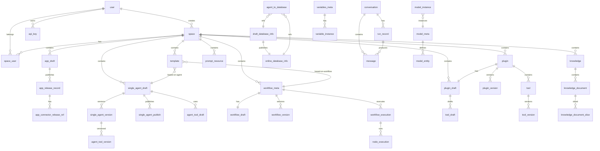

# Coze Studio Database ER Diagram

Complete database entity-relationship diagram for Coze Studio project.

## Database Overview

- **Total Tables**: 55 tables
- **Main Domains**: User/Space, App, Agent, Workflow, Plugin, Knowledge, Database, Conversation, Model, etc.

## ER Diagram

### Main Relationships Diagram

## Detailed Table Structures

### 1. User and Space Domain

#### user
- **id** (PK): bigint - User ID
- **name**: varchar - User nickname
- **unique_name** (UK): varchar - Unique username
- **email** (UK): varchar - Email
- **password**: varchar - Encrypted password
- **icon_uri**: varchar - Avatar URI
- **session_key**: varchar - Session key
- **created_at**: bigint - Create time in milliseconds
- **updated_at**: bigint - Update time in milliseconds
- **deleted_at**: bigint - Delete time in milliseconds

#### space
- **id** (PK): bigint - Space ID
- **owner_id** (FK): bigint - Owner user ID
- **name**: varchar - Space name
- **description**: varchar - Space description
- **icon_uri**: varchar - Icon URI
- **creator_id** (FK): bigint - Creator user ID
- **created_at**: bigint - Create time in milliseconds
- **updated_at**: bigint - Update time in milliseconds
- **deleted_at**: bigint - Delete time in milliseconds

#### space_user
- **id** (PK): bigint - Primary key
- **space_id** (FK): bigint - Space ID
- **user_id** (FK): bigint - User ID
- **role_type**: int - Role type (1:owner 2:admin 3:member)
- **created_at**: bigint - Create time in milliseconds
- **updated_at**: bigint - Update time in milliseconds

#### api_key
- **id** (PK): bigint - API key ID
- **api_key**: varchar - API key hash
- **name**: varchar - API key name
- **status**: tinyint - Status (0:normal 1:deleted)
- **user_id** (FK): bigint - Owner user ID
- **expired_at**: bigint - Expiration time
- **last_used_at**: bigint - Last used time
- **created_at**: bigint - Create time in milliseconds
- **updated_at**: bigint - Update time in milliseconds

### 2. Application Domain

#### app_draft
- **id** (PK): bigint - App ID
- **space_id** (FK): bigint - Space ID
- **owner_id** (FK): bigint - Owner ID
- **icon_uri**: varchar - Icon URI
- **name**: varchar - App name
- **description**: text - App description
- **created_at**: bigint - Create time in milliseconds
- **updated_at**: bigint - Update time in milliseconds
- **deleted_at**: datetime - Delete time

#### app_release_record
- **id** (PK): bigint - Release record ID
- **app_id** (FK): bigint - App ID
- **space_id** (FK): bigint - Space ID
- **version**: varchar - Release version
- **connector_ids**: json - Connector IDs
- **publish_status**: tinyint - Publish status
- **publish_at**: bigint - Publish time
- **created_at**: bigint - Create time in milliseconds
- **updated_at**: bigint - Update time in milliseconds

### 3. Agent Domain

#### single_agent_draft
- **id** (PK): bigint - Primary key
- **agent_id** (UK): bigint - Agent ID
- **space_id** (FK): bigint - Space ID
- **creator_id** (FK): bigint - Creator ID
- **name**: varchar - Agent name
- **description**: text - Agent description
- **model_info**: json - Model configuration
- **prompt**: json - Agent prompt config
- **plugin**: json - Plugin config
- **knowledge**: json - Knowledge config
- **workflow**: json - Workflow config
- **bot_mode**: tinyint - Bot mode (0:single 2:chatflow)
- **created_at**: bigint - Create time in milliseconds
- **updated_at**: bigint - Update time in milliseconds

#### single_agent_version
- **id** (PK): bigint - Primary key
- **agent_id** (FK): bigint - Agent ID
- **version**: varchar - Agent version
- **connector_id** (FK): bigint - Connector ID
- **space_id** (FK): bigint - Space ID
- Similar fields as draft

#### single_agent_publish
- **id** (PK): bigint - Primary key
- **agent_id** (FK): bigint - Agent ID
- **publish_id**: varchar - Publish ID
- **version**: varchar - Agent version
- **connector_ids**: json - Connector IDs
- **status**: tinyint - Status
- **created_at**: bigint - Create time in milliseconds

### 4. Workflow Domain

#### workflow_meta
- **id** (PK): bigint - Workflow ID
- **space_id** (FK): bigint - Space ID
- **app_id** (FK): bigint - App ID
- **name**: varchar - Workflow name
- **description**: varchar - Workflow description
- **status**: tinyint - Status (0:unpublished 1:published)
- **mode**: tinyint - Mode (0:workflow 3:chatflow)
- **creator_id** (FK): bigint - Creator user ID
- **latest_version**: varchar - Latest version
- **created_at**: bigint - Create time in milliseconds
- **updated_at**: bigint - Update time in milliseconds

#### workflow_draft
- **id** (PK, FK): bigint - Workflow ID
- **canvas**: mediumtext - Frontend schema
- **input_params**: mediumtext - Input schema
- **output_params**: mediumtext - Output params schema
- **test_run_success**: bool - Test run success
- **commit_id**: varchar - Commit ID for snapshot
- **updated_at**: bigint - Update time in milliseconds

#### workflow_version
- **id** (PK): bigint - Primary key
- **workflow_id** (FK): bigint - Workflow ID
- **version** (UK): varchar - Published version
- **canvas**: mediumtext - Frontend schema
- **commit_id**: varchar - Commit ID
- **creator_id** (FK): bigint - Creator ID
- **created_at**: bigint - Create time in milliseconds

#### workflow_execution
- **id** (PK): bigint - Execution ID
- **workflow_id** (FK): bigint - Workflow ID
- **version**: varchar - Workflow version
- **space_id** (FK): bigint - Space ID
- **mode**: tinyint - Execution mode
- **status**: tinyint - Status (1:running 2:success 3:fail)
- **duration**: bigint - Duration in milliseconds
- **input_tokens**: bigint - Input token count
- **output_tokens**: bigint - Output token count
- **created_at**: bigint - Create time in milliseconds

#### node_execution
- **id** (PK): bigint - Node execution ID
- **execute_id** (FK): bigint - Workflow execution ID
- **node_id**: varchar - Node key
- **node_type**: varchar - Node type
- **status**: tinyint - Status
- **input**: mediumtext - Actual input
- **output**: mediumtext - Actual output
- **created_at**: bigint - Create time in milliseconds

### 5. Plugin and Tool Domain

#### plugin
- **id** (PK): bigint - Plugin ID
- **space_id** (FK): bigint - Space ID
- **app_id** (FK): bigint - App ID
- **server_url**: varchar - Server URL
- **plugin_type**: tinyint - Plugin type (1:http 6:local)
- **version**: varchar - Plugin version
- **manifest**: json - Plugin manifest
- **openapi_doc**: json - OpenAPI document
- **created_at**: bigint - Create time in milliseconds
- **updated_at**: bigint - Update time in milliseconds

#### plugin_draft
- Similar structure to plugin
- **deleted_at**: datetime - Delete time

#### tool
- **id** (PK): bigint - Tool ID
- **plugin_id** (FK): bigint - Plugin ID
- **version**: varchar - Tool version
- **sub_url**: varchar - Sub URL path
- **method**: varchar - HTTP method
- **operation**: json - OpenAPI operation schema
- **activated_status**: tinyint - Status
- **created_at**: bigint - Create time in milliseconds

#### tool_draft
- Similar structure to tool
- **debug_status**: tinyint - Debug status

### 6. Knowledge Domain

#### knowledge
- **id** (PK): bigint - Knowledge ID
- **space_id** (FK): bigint - Space ID
- **app_id** (FK): bigint - App ID
- **creator_id** (FK): bigint - Creator ID
- **name**: varchar - Knowledge name
- **description**: text - Description
- **status**: tinyint - Status
- **format_type**: tinyint - Format type (0:text 1:table 2:image)
- **created_at**: bigint - Create time in milliseconds
- **updated_at**: bigint - Update time in milliseconds
- **deleted_at**: datetime - Delete time

#### knowledge_document
- **id** (PK): bigint - Document ID
- **knowledge_id** (FK): bigint - Knowledge ID
- **space_id** (FK): bigint - Space ID
- **name**: varchar - Document name
- **file_extension**: varchar - File extension
- **document_type**: int - Document type
- **uri**: text - URI
- **size**: bigint - File size
- **slice_count**: bigint - Slice count
- **status**: int - Status
- **created_at**: bigint - Create time in milliseconds
- **updated_at**: bigint - Update time in milliseconds

#### knowledge_document_slice
- **id** (PK): bigint - Slice ID
- **knowledge_id** (FK): bigint - Knowledge ID
- **document_id** (FK): bigint - Document ID
- **space_id** (FK): bigint - Space ID
- **content**: text - Content
- **sequence**: decimal - Slice sequence number
- **status**: int - Status
- **hit**: bigint - Hit count
- **created_at**: bigint - Create time in milliseconds

### 7. Database Domain

#### draft_database_info
- **id** (PK): bigint - Database ID
- **app_id** (FK): bigint - App ID
- **space_id** (FK): bigint - Space ID
- **related_online_id** (FK): bigint - Related online database ID
- **table_name**: varchar - Table name
- **table_field**: text - Table field info
- **rw_mode**: bigint - Read-write mode
- **created_at**: bigint - Create time in milliseconds
- **updated_at**: bigint - Update time in milliseconds

#### online_database_info
- **id** (PK): bigint - Database ID
- **app_id** (FK): bigint - App ID
- **space_id** (FK): bigint - Space ID
- **related_draft_id** (FK): bigint - Related draft database ID
- Similar fields as draft

#### agent_to_database
- **id** (PK): bigint - Primary key
- **agent_id** (FK): bigint - Agent ID
- **database_id** (FK): bigint - Database ID
- **is_draft**: bool - Is draft
- **prompt_disable**: bool - Prompt support

### 8. Conversation and Message Domain

#### conversation
- **id** (PK): bigint - Conversation ID
- **name**: varchar - Conversation name
- **connector_id** (FK): bigint - Connector ID
- **agent_id** (FK): bigint - Agent ID
- **creator_id** (FK): bigint - Creator ID
- **status**: tinyint - Status
- **created_at**: bigint - Create time in milliseconds
- **updated_at**: bigint - Update time in milliseconds

#### message
- **id** (PK): bigint - Message ID
- **run_id** (FK): bigint - Run ID
- **conversation_id** (FK): bigint - Conversation ID
- **user_id** (FK): varchar - User ID
- **agent_id** (FK): bigint - Agent ID
- **role**: varchar - Role (user/assistant/system)
- **content**: mediumtext - Content
- **status**: tinyint - Status
- **created_at**: bigint - Create time in milliseconds
- **updated_at**: bigint - Update time in milliseconds

#### run_record
- **id** (PK): bigint - Run record ID
- **conversation_id** (FK): bigint - Conversation ID
- **agent_id** (FK): bigint - Agent ID
- **user_id** (FK): varchar - User ID
- **status**: varchar - Status
- **usage**: json - Token usage
- **created_at**: bigint - Create time in milliseconds
- **updated_at**: bigint - Update time in milliseconds

### 9. Model Domain

#### model_meta
- **id** (PK): bigint - Model metadata ID
- **model_name**: varchar - Model name
- **protocol**: varchar - Model protocol
- **capability**: json - Capability
- **status**: int - Status
- **created_at**: bigint - Create time in milliseconds
- **updated_at**: bigint - Update time in milliseconds

#### model_entity
- **id** (PK): bigint - Model entity ID
- **meta_id** (FK): bigint - Model metadata ID
- **name**: varchar - Name
- **default_params**: json - Default parameters
- **scenario**: bigint - Scenario
- **status**: int - Status
- **created_at**: bigint - Create time in milliseconds

#### model_instance
- **id** (PK): bigint - Model instance ID
- **type**: tinyint - Model type (0:LLM 1:TextEmbedding 2:Rerank)
- **provider**: json - Provider info
- **connection**: json - Connection info
- **capability**: json - Capability
- **parameters**: json - Parameters
- **created_at**: bigint - Create time in milliseconds

### 10. Variable Domain

#### variables_meta
- **id** (PK): bigint - Variable metadata ID
- **creator_id** (FK): bigint - Creator ID
- **biz_type**: tinyint - Business type (1:agent 2:app)
- **biz_id**: varchar - Business ID
- **version**: varchar - Version
- **variable_list**: json - Variable list
- **created_at**: bigint - Create time in milliseconds
- **updated_at**: bigint - Update time in milliseconds

#### variable_instance
- **id** (PK): bigint - Variable instance ID
- **biz_type**: tinyint - Business type
- **biz_id**: varchar - Business ID
- **version**: varchar - Version
- **keyword**: varchar - Keyword
- **type**: tinyint - Type (1:KV 2:list)
- **content**: text - Content
- **connector_uid**: varchar - Connector UID
- **connector_id**: bigint - Connector ID
- **created_at**: bigint - Create time in milliseconds

### 11. Other Supporting Tables

#### template
- **id** (PK): bigint - Template ID
- **agent_id** (FK): bigint - Agent ID
- **workflow_id** (FK): bigint - Workflow ID
- **space_id** (FK): bigint - Space ID
- **product_entity_type**: bigint - Product entity type
- **meta_info**: json - Meta info
- **created_at**: bigint - Create time in milliseconds

#### files
- **id** (PK): bigint - File ID
- **name**: varchar - File name
- **file_size**: bigint - File size
- **tos_uri**: varchar - TOS URI
- **status**: tinyint - Status
- **creator_id** (FK): varchar - Creator ID
- **created_at**: bigint - Create time in milliseconds
- **updated_at**: bigint - Update time in milliseconds

#### prompt_resource
- **id** (PK): bigint - Prompt resource ID
- **space_id** (FK): bigint - Space ID
- **name**: varchar - Name
- **prompt_text**: mediumtext - Prompt text
- **status**: int - Status
- **creator_id** (FK): bigint - Creator ID
- **created_at**: bigint - Create time in milliseconds

#### kv_entries
- **id** (PK): bigint - Primary key
- **namespace**: varchar - Namespace
- **key_data** (UK): varchar - Key data
- **value_data**: longblob - Value data

## Key Design Patterns

### 1. Draft-Version Pattern
Many entities follow a draft-version pattern for managing changes:
- **App**: `app_draft` → `app_release_record`
- **Agent**: `single_agent_draft` → `single_agent_version`
- **Workflow**: `workflow_draft` → `workflow_version`
- **Plugin**: `plugin_draft` → `plugin_version`
- **Tool**: `tool_draft` → `tool_version`
- **Database**: `draft_database_info` ↔ `online_database_info`

### 2. Multi-tenancy Pattern
All core business tables are associated with `space_id` for data isolation. Users manage access to different spaces through the `space_user` table.

### 3. Soft Delete Pattern
Most tables include a `deleted_at` field for soft deletion, supporting data recovery.

### 4. Version Control Pattern
- Multiple versions can coexist
- Versions are bound to connectors for gradual rollout
- `commit_id` links to snapshots for version rollback

### 5. Event-driven Pattern
- Workflow execution → Node execution
- Conversation → Run record → Message
- Supports asynchronous processing and state tracking

## Table Statistics

| Domain | Table Count |
|--------|------------|
| User and Space | 3 |
| Application | 7 |
| Agent | 7 |
| Workflow | 8 |
| Plugin and Tool | 7 |
| Knowledge | 4 |
| Database | 3 |
| Conversation and Message | 9 |
| Model | 3 |
| Variable | 2 |
| Other | 6 |
| **Total** | **55** |

## Entity Relationship Summary

### Primary Relationships

1. **User → Space**: One-to-many through ownership and membership
2. **Space → Entities**: One-to-many for all major entities (apps, agents, workflows, etc.)
3. **Draft → Version**: One-to-many for all versionable entities
4. **Agent → Tools/Databases**: Many-to-many through junction tables
5. **Workflow → Execution**: One-to-many, execution to node execution
6. **Knowledge → Documents → Slices**: Hierarchical one-to-many
7. **Conversation → Messages/Runs**: One-to-many for chat history

### Cross-domain Relationships

- **Template** references both Agent and Workflow
- **Agent** can use Plugins, Knowledge, Workflows, and Databases
- **Workflow** can reference other workflows through `workflow_reference`
- **App** orchestrates Agents, Workflows, and Connectors

---

*Generated: 2025-11-05*
*Database: opencoze*
*Charset: utf8mb4_unicode_ci*

