# Coze Studio 数据库 UML 图 (分组视图)

本文档展示按业务域分组的数据库 ER 图，清晰显示各个领域的表及其关联关系。

## 数据库概览

- **总表数**: 55 个表
- **主要业务域**: 10+ 个业务域
- **核心关系**: 用户空间、应用、Agent、工作流、插件、知识库等

## 分组 ER 图

```mermaid
graph TB
    subgraph UserSpace["用户与空间域 (User & Space)"]
        user["<b>user</b><br/>用户表<br/>---<br/>id: bigint PK<br/>name: varchar<br/>email: varchar UK<br/>session_key: varchar"]
        space["<b>space</b><br/>空间表<br/>---<br/>id: bigint PK<br/>owner_id: bigint FK<br/>name: varchar<br/>creator_id: bigint FK"]
        space_user["<b>space_user</b><br/>空间成员表<br/>---<br/>id: bigint PK<br/>space_id: bigint FK<br/>user_id: bigint FK<br/>role_type: int"]
        api_key["<b>api_key</b><br/>API密钥表<br/>---<br/>id: bigint PK<br/>user_id: bigint FK<br/>api_key: varchar<br/>expired_at: bigint"]
    end
    
    subgraph AppDomain["应用域 (Application)"]
        app_draft["<b>app_draft</b><br/>应用草稿<br/>---<br/>id: bigint PK<br/>space_id: bigint FK<br/>owner_id: bigint FK<br/>name: varchar"]
        app_release["<b>app_release_record</b><br/>发布记录<br/>---<br/>id: bigint PK<br/>app_id: bigint FK<br/>version: varchar<br/>publish_status: tinyint"]
        app_connector["<b>app_connector_release_ref</b><br/>连接器引用<br/>---<br/>id: bigint PK<br/>record_id: bigint FK<br/>connector_id: bigint FK"]
        app_conv_draft["<b>app_conversation_template_draft</b><br/>会话模板草稿<br/>---<br/>id: bigint PK<br/>app_id: bigint FK<br/>template_id: bigint FK"]
        app_conv_online["<b>app_conversation_template_online</b><br/>会话模板在线<br/>---<br/>id: bigint PK<br/>app_id: bigint FK<br/>version: varchar"]
    end
    
    subgraph AgentDomain["Agent 域"]
        agent_draft["<b>single_agent_draft</b><br/>Agent草稿<br/>---<br/>id: bigint PK<br/>agent_id: bigint UK<br/>space_id: bigint FK<br/>model_info: json<br/>prompt: json"]
        agent_version["<b>single_agent_version</b><br/>Agent版本<br/>---<br/>id: bigint PK<br/>agent_id: bigint FK<br/>version: varchar<br/>connector_id: bigint FK"]
        agent_publish["<b>single_agent_publish</b><br/>Agent发布<br/>---<br/>id: bigint PK<br/>agent_id: bigint FK<br/>publish_id: varchar<br/>status: tinyint"]
        agent_tool_draft["<b>agent_tool_draft</b><br/>Agent工具草稿<br/>---<br/>id: bigint PK<br/>agent_id: bigint FK<br/>plugin_id: bigint FK<br/>tool_id: bigint FK"]
        agent_tool_version["<b>agent_tool_version</b><br/>Agent工具版本<br/>---<br/>id: bigint PK<br/>agent_id: bigint FK<br/>agent_version: varchar"]
        agent_to_db["<b>agent_to_database</b><br/>Agent数据库关联<br/>---<br/>id: bigint PK<br/>agent_id: bigint FK<br/>database_id: bigint FK<br/>is_draft: bool"]
    end
    
    subgraph WorkflowDomain["工作流域 (Workflow)"]
        workflow_meta["<b>workflow_meta</b><br/>工作流元数据<br/>---<br/>id: bigint PK<br/>space_id: bigint FK<br/>name: varchar<br/>status: tinyint<br/>mode: tinyint"]
        workflow_draft["<b>workflow_draft</b><br/>工作流草稿<br/>---<br/>id: bigint PK/FK<br/>canvas: mediumtext<br/>input_params: mediumtext<br/>commit_id: varchar"]
        workflow_version["<b>workflow_version</b><br/>工作流版本<br/>---<br/>id: bigint PK<br/>workflow_id: bigint FK<br/>version: varchar UK<br/>commit_id: varchar"]
        workflow_exec["<b>workflow_execution</b><br/>工作流执行<br/>---<br/>id: bigint PK<br/>workflow_id: bigint FK<br/>version: varchar<br/>status: tinyint<br/>duration: bigint"]
        node_exec["<b>node_execution</b><br/>节点执行<br/>---<br/>id: bigint PK<br/>execute_id: bigint FK<br/>node_id: varchar<br/>status: tinyint"]
        workflow_snapshot["<b>workflow_snapshot</b><br/>工作流快照<br/>---<br/>id: bigint PK<br/>workflow_id: bigint FK<br/>commit_id: varchar UK<br/>canvas: mediumtext"]
        workflow_ref["<b>workflow_reference</b><br/>工作流引用<br/>---<br/>id: bigint PK<br/>referred_id: bigint FK<br/>referring_id: bigint FK<br/>refer_type: tinyint"]
    end
    
    subgraph PluginDomain["插件与工具域 (Plugin & Tool)"]
        plugin["<b>plugin</b><br/>插件<br/>---<br/>id: bigint PK<br/>space_id: bigint FK<br/>app_id: bigint FK<br/>version: varchar<br/>manifest: json"]
        plugin_draft["<b>plugin_draft</b><br/>插件草稿<br/>---<br/>id: bigint PK<br/>space_id: bigint FK<br/>app_id: bigint FK<br/>manifest: json"]
        plugin_version["<b>plugin_version</b><br/>插件版本<br/>---<br/>id: bigint PK<br/>plugin_id: bigint FK<br/>version: varchar"]
        tool["<b>tool</b><br/>工具<br/>---<br/>id: bigint PK<br/>plugin_id: bigint FK<br/>sub_url: varchar<br/>method: varchar<br/>operation: json"]
        tool_draft["<b>tool_draft</b><br/>工具草稿<br/>---<br/>id: bigint PK<br/>plugin_id: bigint FK<br/>debug_status: tinyint"]
        tool_version["<b>tool_version</b><br/>工具版本<br/>---<br/>id: bigint PK<br/>tool_id: bigint FK<br/>version: varchar"]
        plugin_oauth["<b>plugin_oauth_auth</b><br/>OAuth认证<br/>---<br/>id: bigint PK<br/>user_id: varchar FK<br/>plugin_id: bigint FK<br/>access_token: text"]
    end
    
    subgraph KnowledgeDomain["知识库域 (Knowledge)"]
        knowledge["<b>knowledge</b><br/>知识库<br/>---<br/>id: bigint PK<br/>space_id: bigint FK<br/>app_id: bigint FK<br/>name: varchar<br/>format_type: tinyint"]
        knowledge_doc["<b>knowledge_document</b><br/>知识文档<br/>---<br/>id: bigint PK<br/>knowledge_id: bigint FK<br/>name: varchar<br/>document_type: int<br/>status: int"]
        knowledge_slice["<b>knowledge_document_slice</b><br/>文档切片<br/>---<br/>id: bigint PK<br/>knowledge_id: bigint FK<br/>document_id: bigint FK<br/>content: text<br/>sequence: decimal"]
        knowledge_review["<b>knowledge_document_review</b><br/>文档审核<br/>---<br/>id: bigint PK<br/>knowledge_id: bigint FK<br/>name: varchar<br/>status: tinyint"]
    end
    
    subgraph DatabaseDomain["数据库域 (Database)"]
        draft_db["<b>draft_database_info</b><br/>草稿数据库<br/>---<br/>id: bigint PK<br/>app_id: bigint FK<br/>space_id: bigint FK<br/>related_online_id: bigint FK<br/>table_name: varchar"]
        online_db["<b>online_database_info</b><br/>在线数据库<br/>---<br/>id: bigint PK<br/>app_id: bigint FK<br/>space_id: bigint FK<br/>related_draft_id: bigint FK<br/>table_name: varchar"]
    end
    
    subgraph ConversationDomain["会话与消息域 (Conversation & Message)"]
        conversation["<b>conversation</b><br/>会话<br/>---<br/>id: bigint PK<br/>connector_id: bigint FK<br/>agent_id: bigint FK<br/>creator_id: bigint FK<br/>status: tinyint"]
        message["<b>message</b><br/>消息<br/>---<br/>id: bigint PK<br/>run_id: bigint FK<br/>conversation_id: bigint FK<br/>agent_id: bigint FK<br/>role: varchar<br/>content: mediumtext"]
        run_record["<b>run_record</b><br/>运行记录<br/>---<br/>id: bigint PK<br/>conversation_id: bigint FK<br/>agent_id: bigint FK<br/>status: varchar<br/>usage: json"]
    end
    
    subgraph ModelDomain["模型域 (Model)"]
        model_meta["<b>model_meta</b><br/>模型元数据<br/>---<br/>id: bigint PK<br/>model_name: varchar<br/>protocol: varchar<br/>capability: json"]
        model_entity["<b>model_entity</b><br/>模型实体<br/>---<br/>id: bigint PK<br/>meta_id: bigint FK<br/>name: varchar<br/>scenario: bigint"]
        model_instance["<b>model_instance</b><br/>模型实例<br/>---<br/>id: bigint PK<br/>type: tinyint<br/>provider: json<br/>capability: json"]
    end
    
    subgraph VariableDomain["变量域 (Variable)"]
        variables_meta["<b>variables_meta</b><br/>变量元数据<br/>---<br/>id: bigint PK<br/>creator_id: bigint FK<br/>biz_type: tinyint<br/>biz_id: varchar<br/>version: varchar"]
        variable_instance["<b>variable_instance</b><br/>变量实例<br/>---<br/>id: bigint PK<br/>biz_type: tinyint<br/>biz_id: varchar<br/>keyword: varchar<br/>content: text"]
    end
    
    subgraph OtherDomain["其他支撑域 (Others)"]
        template["<b>template</b><br/>模板<br/>---<br/>id: bigint PK<br/>agent_id: bigint FK<br/>workflow_id: bigint FK<br/>space_id: bigint FK<br/>meta_info: json"]
        files["<b>files</b><br/>文件<br/>---<br/>id: bigint PK<br/>name: varchar<br/>tos_uri: varchar<br/>creator_id: varchar FK"]
        prompt_resource["<b>prompt_resource</b><br/>Prompt资源<br/>---<br/>id: bigint PK<br/>space_id: bigint FK<br/>name: varchar<br/>prompt_text: mediumtext"]
        shortcut_command["<b>shortcut_command</b><br/>快捷命令<br/>---<br/>id: bigint PK<br/>object_id: bigint FK<br/>work_flow_id: bigint FK<br/>plugin_id: bigint FK"]
        kv_entries["<b>kv_entries</b><br/>KV存储<br/>---<br/>id: bigint PK<br/>namespace: varchar<br/>key_data: varchar UK"]
        data_copy_task["<b>data_copy_task</b><br/>数据复制任务<br/>---<br/>id: bigint PK<br/>origin_data_id: bigint FK<br/>target_data_id: bigint FK<br/>data_type: tinyint"]
    end
    
    %% 用户空间关系
    user -->|creates| space
    user -->|belongs| space_user
    space -->|has| space_user
    user -->|owns| api_key
    
    %% 空间到各域关系
    space -.->|contains| app_draft
    space -.->|contains| agent_draft
    space -.->|contains| workflow_meta
    space -.->|contains| knowledge
    space -.->|contains| plugin
    space -.->|contains| plugin_draft
    space -.->|contains| prompt_resource
    space -.->|contains| template
    
    %% App域内部关系
    app_draft -->|publishes| app_release
    app_release -->|has| app_connector
    app_draft -->|has| app_conv_draft
    app_draft -->|publishes| app_conv_online
    
    %% Agent域内部关系
    agent_draft -->|versions| agent_version
    agent_draft -->|publishes| agent_publish
    agent_draft -->|uses| agent_tool_draft
    agent_version -->|versioned| agent_tool_version
    agent_draft -->|connects| agent_to_db
    
    %% Workflow域内部关系
    workflow_meta -->|has| workflow_draft
    workflow_meta -->|versions| workflow_version
    workflow_meta -->|executes| workflow_exec
    workflow_exec -->|runs| node_exec
    workflow_draft -->|snapshots| workflow_snapshot
    workflow_meta -->|refs| workflow_ref
    
    %% Plugin域内部关系
    plugin -.->|has draft| plugin_draft
    plugin -->|versions| plugin_version
    plugin -->|contains| tool
    plugin_draft -->|drafts| tool_draft
    tool -->|versions| tool_version
    plugin -->|oauth| plugin_oauth
    
    %% Knowledge域内部关系
    knowledge -->|contains| knowledge_doc
    knowledge -->|reviews| knowledge_review
    knowledge_doc -->|sliced| knowledge_slice
    
    %% Database域内部关系
    draft_db -.->|publishes| online_db
    agent_to_db -->|refs draft| draft_db
    agent_to_db -->|refs online| online_db
    
    %% Conversation域内部关系
    conversation -->|contains| message
    conversation -->|has| run_record
    run_record -->|produces| message
    
    %% Model域内部关系
    model_meta -->|defines| model_entity
    model_meta -.->|instances| model_instance
    
    %% Variable域内部关系
    variables_meta -->|has| variable_instance
    
    %% 跨域关系
    agent_draft -.->|uses| plugin
    agent_draft -.->|uses| knowledge
    agent_draft -.->|uses| workflow_meta
    agent_draft -.->|variables| variables_meta
    template -.->|based on| agent_draft
    template -.->|based on| workflow_meta
    user -.->|uploads| files
    agent_draft -.->|commands| shortcut_command
    shortcut_command -.->|workflow| workflow_meta
    shortcut_command -.->|plugin| plugin
    
    %% 样式定义
    classDef userSpaceStyle fill:#E3F2FD,stroke:#1976D2,stroke-width:2px
    classDef appStyle fill:#F3E5F5,stroke:#7B1FA2,stroke-width:2px
    classDef agentStyle fill:#E8F5E9,stroke:#388E3C,stroke-width:2px
    classDef workflowStyle fill:#FFF3E0,stroke:#F57C00,stroke-width:2px
    classDef pluginStyle fill:#FCE4EC,stroke:#C2185B,stroke-width:2px
    classDef knowledgeStyle fill:#E0F2F1,stroke:#00796B,stroke-width:2px
    classDef databaseStyle fill:#FFF9C4,stroke:#F57F17,stroke-width:2px
    classDef conversationStyle fill:#E1F5FE,stroke:#0277BD,stroke-width:2px
    classDef modelStyle fill:#F1F8E9,stroke:#558B2F,stroke-width:2px
    classDef variableStyle fill:#EFEBE9,stroke:#5D4037,stroke-width:2px
    classDef otherStyle fill:#ECEFF1,stroke:#455A64,stroke-width:2px
    
    class user,space,space_user,api_key userSpaceStyle
    class app_draft,app_release,app_connector,app_conv_draft,app_conv_online appStyle
    class agent_draft,agent_version,agent_publish,agent_tool_draft,agent_tool_version,agent_to_db agentStyle
    class workflow_meta,workflow_draft,workflow_version,workflow_exec,node_exec,workflow_snapshot,workflow_ref workflowStyle
    class plugin,plugin_draft,plugin_version,tool,tool_draft,tool_version,plugin_oauth pluginStyle
    class knowledge,knowledge_doc,knowledge_slice,knowledge_review knowledgeStyle
    class draft_db,online_db databaseStyle
    class conversation,message,run_record conversationStyle
    class model_meta,model_entity,model_instance modelStyle
    class variables_meta,variable_instance variableStyle
    class template,files,prompt_resource,shortcut_command,kv_entries,data_copy_task otherStyle
```



## 图例说明

### 关系类型
- **实线箭头** (→): 域内主要关系
- **虚线箭头** (-.->): 跨域关系或弱引用

### 颜色分组
- 🔵 **蓝色**: 用户与空间域
- 🟣 **紫色**: 应用域
- 🟢 **绿色**: Agent 域
- 🟠 **橙色**: 工作流域
- 🔴 **粉色**: 插件与工具域
- 🟡 **青色**: 知识库域
- 🟡 **黄色**: 数据库域
- 🔵 **浅蓝**: 会话与消息域
- 🟢 **浅绿**: 模型域
- 🟤 **棕色**: 变量域
- ⚫ **灰色**: 其他支撑域

## 业务域关系说明

### 1. 用户空间作为基础
- 用户通过 space_user 加入空间
- 空间包含所有业务实体（App、Agent、Workflow等）

### 2. 核心业务域
- **App域**: 管理应用的草稿、发布、连接器
- **Agent域**: 管理智能体的配置、工具、数据库连接
- **Workflow域**: 管理工作流的设计、版本、执行
- **Plugin域**: 管理插件和工具的开发、发布

### 3. 数据域
- **Knowledge域**: 管理文档和知识库
- **Database域**: 管理结构化数据表
- **Model域**: 管理AI模型配置

### 4. 运行时域
- **Conversation域**: 管理用户对话和消息
- **Variable域**: 管理运行时变量
- **Execution**: 工作流和节点的执行记录

### 5. 支撑域
- Template、Files、Prompt、Shortcut等支撑功能

## 关键设计模式

### 草稿-版本-发布模式
```
Draft → Version → Publish
  ↓        ↓         ↓
编辑态   历史版本   生产态
```

### 多租户隔离
```
User → Space → Entities
         ↓
    Data Isolation
```

---

*生成时间: 2025-11-05*
*数据库: opencoze*
*总表数: 55*

