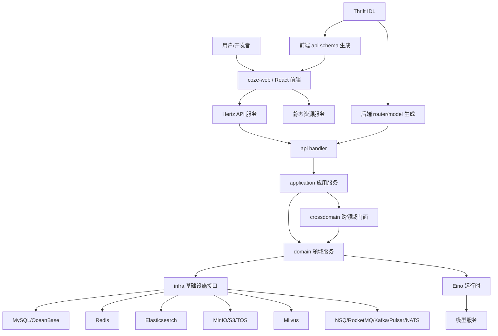

# 架构全景

## 项目概述

**它是什么**：Coze Studio 是一个开源的一站式 AI Agent 可视化开发平台，把智能体、应用、工作流、插件、知识库、数据库、模型服务、开放接口和前端编辑体验放在同一套工程体系中。

**为什么存在**：AI Agent 产品如果从零搭建，需要同时处理模型接入、工具调用、RAG、可视化编排、调试、发布、权限、会话、部署和前端编辑器。Coze Studio 将这些能力沉淀成可二次开发的平台，开发者可以重点关注业务智能体和业务流程，而不是反复搭建基础框架。

**核心设计理念**：后端采用“接口生成层 + 应用编排层 + 领域层 + 基础设施层”的分层方式，前端采用“主应用薄壳 + Rush 多包业务模块”的方式；二者通过 IDL 和生成代码连接。

## 总体模块

### 后端服务

**它是什么**：`backend` 是 Go 后端服务，入口是 `backend/main.go`，使用 Hertz 提供 HTTP API，并托管部分静态资源。

**为什么存在**：后端需要承担 API、鉴权、领域编排、工作流运行、Agent 运行、数据库访问、消息事件和外部存储适配。如果把这些逻辑直接塞进 handler，业务流会很快失控，所以项目把它拆成 `api`、`application`、`domain`、`infra` 等层。

**主要文件**：

- `backend/main.go`：加载环境、初始化应用服务、启动 Hertz。
- `backend/api/router`：由 IDL 生成的路由注册。
- `backend/api/handler/coze`：HTTP handler，负责请求绑定、错误响应和调用应用服务。
- `backend/application`：应用服务装配和用例编排。
- `backend/domain`：业务领域模型、仓储接口和领域服务。
- `backend/infra`：数据库、缓存、对象存储、消息队列、向量库、搜索、代码执行等基础设施适配。

### 前端应用

**它是什么**：`frontend` 是 React + TypeScript 前端，使用 Rush 管理大量 workspace 包。主应用位于 `frontend/apps/coze-studio`。

**为什么存在**：Coze Studio 的前端不是单页管理后台，而是一组复杂工作台：空间、Agent IDE、Project IDE、Workflow 画布、资源库、知识库、插件、市场等。Rush 多包结构让基础能力、业务页面和编辑器能力可以独立演进。

**主要文件**：

- `frontend/apps/coze-studio/src/index.tsx`：初始化功能开关、国际化和样式，然后挂载 React。
- `frontend/apps/coze-studio/src/routes/index.tsx`：主路由。
- `frontend/apps/coze-studio/src/routes/async-components.tsx`：业务页面懒加载入口。
- `frontend/packages/agent-ide`：智能体编辑器能力。
- `frontend/packages/workflow`：工作流画布、节点、渲染、试运行、SDK。
- `frontend/packages/project-ide`：应用式 IDE。
- `frontend/packages/foundation`：账户、空间、全局布局和全局状态。
- `frontend/packages/arch`：API、HTTP、IDL、日志、国际化、上下文等前端基础层。

### IDL 与生成代码

**它是什么**：`idl` 保存 Thrift 接口定义，后端生成 API model/router，前端通过 `idl2ts` 生成 TypeScript schema。

**为什么存在**：前后端共享接口契约是这类平台的稳定性基础。IDL 让路由、请求响应模型和部分客户端类型从同一份协议生成，减少手写接口漂移。

**主要文件**：

- `idl/api.thrift`：主 IDL 入口。
- `idl/workflow`、`idl/conversation`、`idl/app`、`idl/plugin`、`idl/data` 等：按业务域拆分的接口定义。
- `backend/api/model`、`backend/api/router`：后端生成产物。
- `frontend/packages/arch/api-schema`：前端开源 API schema 包，`update` 脚本执行 `idl2ts gen ./`。

### 部署与中间件

**它是什么**：`docker` 和 `helm` 提供本地与集群部署方案。

**为什么存在**：Coze Studio 不是纯无状态应用，它依赖关系型数据库、缓存、对象存储、向量检索、搜索引擎和消息队列。部署目录把这些依赖显式编排出来，降低本地体验和生产部署门槛。

**主要文件**：

- `docker/docker-compose.yml`：完整 Web 环境，包含 `coze-server`、`coze-web`、MySQL、Redis、Elasticsearch、MinIO、etcd、Milvus、NSQ。
- `docker/docker-compose-debug.yml`：本地开发中间件环境，暴露本地端口。
- `helm/charts/opencoze`：Kubernetes 部署模板，包含 server、web、中间件和可选 OceanBase、RocketMQ。
- `Makefile`：封装 `make web`、`make debug`、`make fe`、`make server`、数据库迁移和 ES 初始化。

## 模块依赖关系

## 关键入口

### 后端启动入口

`backend/main.go` 的启动顺序很明确：

1. 设置 crash 输出。
2. 加载 `.env` 或 `.env.{APP_ENV}`。
3. 设置日志级别。
4. 执行 `application.Init(ctx)`。
5. 启动 Hertz HTTP server。
6. 按顺序挂载 ContextCache、RequestInspector、SetHost、SetLogID、CORS、AccessLog、OpenAPI 鉴权、Session 鉴权、I18n。
7. 调用 `router.GeneratedRegister(s)` 注册 API 和静态资源路由。

### 前端启动入口

`frontend/apps/coze-studio/src/index.tsx` 做三件事：

1. 拉取功能开关。
2. 初始化国际化。
3. 动态加载 Markdown 样式并渲染 `App`。

`App` 本身只包一层 Suspense 和 `RouterProvider`，真实业务页面都来自懒加载包。

## 核心抽象

### Application Service

**它是什么**：应用层用例服务，负责把请求模型、用户上下文、领域服务和基础设施组合成一个业务动作。

**为什么是核心**：它隔离了 API handler 和领域服务。handler 不需要知道领域对象如何协作，领域层也不需要知道 HTTP 请求长什么样。

### Domain Service

**它是什么**：领域能力的主接口，例如 `workflow.Service`、`singleagent.SingleAgent`、`conversation.Run`。

**为什么是核心**：它定义系统真正能做什么。以 workflow 为例，接口覆盖 CRUD、发布、验证、执行、工具化、会话和资源同步。

### Repository

**它是什么**：领域数据访问和运行时状态接口。

**为什么是核心**：业务对象既要落库，也要支持草稿、版本、执行历史、引用关系、checkpoint 等状态。Repository 把这些状态操作集中成领域契约。

### Crossdomain

**它是什么**：跨领域访问门面，在 `application.Init` 末尾注册默认服务。

**为什么是核心**：Agent 运行需要调用 workflow、plugin、knowledge、variables、database、message 等多个领域。直接互相 import 会形成强耦合，crossdomain 提供了一层间接访问。

### Workflow Node Adaptor

**它是什么**：将前端画布节点配置转换为后端可执行 schema 的适配器。

**为什么是核心**：工作流可视化编辑和运行时执行的模型不同。适配器负责把用户拖拽出来的节点变成 Eino 能执行的节点图。

## 扩展机制

### 基础设施多实现

`infra` 中的 eventbus、storage、coderunner、embedding、document parser 等都按接口和实现拆分。EventBus 支持 nsq、kafka、rmq、pulsar、nats；Storage 支持 minio、s3、tos。

### Workflow 节点系统

Workflow 节点通过 `RegisterAllNodeAdaptors` 集中注册，节点实现分布在 `backend/domain/workflow/internal/nodes` 下。新增节点时，需要补节点类型、元数据、适配器和执行实现。

### 前端包适配层

前端大量包以 `*-adapter` 形式存在，例如 `agent-ide/entry-adapter`、`workflow/playground-adapter`、`space-ui-adapter`。这让开源版可以用适配层隔离具体实现和运行环境差异。

