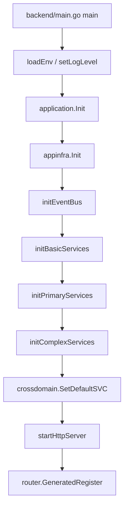
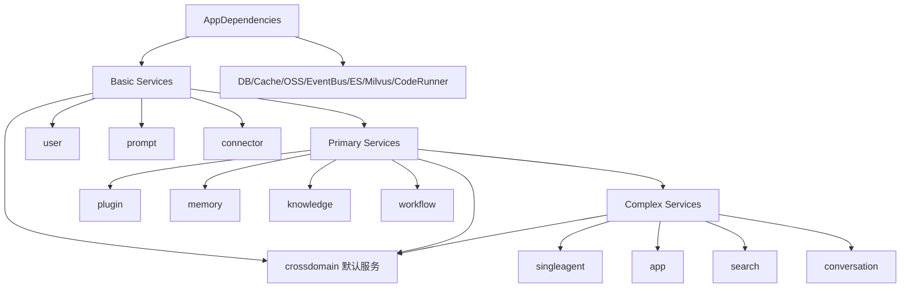

# 核心机制：服务装配与跨领域调用

## 这是什么机制

**它是什么**：服务装配机制是后端启动时由 `application.Init` 统一初始化基础设施、应用服务、领域服务和跨领域门面的过程。

**为什么需要它**：Coze Studio 的业务模块彼此依赖很密集。Workflow 需要插件、知识库、变量、数据库和代码执行器；Agent 需要模型、插件、工作流、知识库、变量和会话；搜索又需要监听资源事件。如果没有集中装配，模块之间会出现循环依赖、隐式初始化顺序和难以测试的全局状态。

**设计核心**：先装基础设施，再按依赖复杂度分层装应用服务，最后注册 crossdomain 默认服务。这样把“对象如何创建”和“业务如何运行”分离。

## 初始化调用链

## 基础设施装配

`appinfra.Init` 生成 `AppDependencies`。它是什么：后端运行时需要的一组基础能力集合。它为什么存在：应用服务不应该知道每种基础设施具体怎样创建，只需要拿到可用依赖。

`AppDependencies` 包含：

- `DB`：GORM 数据库连接。
- `CacheCli`：Redis 命令接口。
- `IDGenSVC`：ID 生成器。
- `ESClient`：Elasticsearch 客户端。
- `ImageXClient`：图片资源处理。
- `OSS`：对象存储。
- `ResourceEventProducer`、`AppEventProducer`、`KnowledgeEventProducer`：资源、应用、知识库事件生产者。
- `CodeRunner`：工作流代码节点执行器。
- `ParserManager`、`SearchStoreManagers`、`Reranker`、`Rewriter`、`NL2SQL`：知识库文档处理、检索和查询改写。
- `WorkflowBuildInChatModel`：工作流内置模型。

初始化顺序也有含义：对象存储、数据库、缓存和 ID 生成器先准备好，配置系统随后初始化，因为模型配置和知识库配置依赖数据库与对象存储。

## 应用服务分层

### Basic Services

**它是什么**：只依赖基础设施的核心服务。

**为什么存在**：这些服务是更复杂业务的底座，先初始化可以让后续服务稳定引用。

包含：

- upload
- openauth
- prompt
- modelmgr
- connector
- user
- template
- permission

### Primary Services

**它是什么**：依赖基础服务的业务服务。

**为什么存在**：这些服务已经开始组合多个领域能力，例如 workflow 需要插件、变量、知识库和代码执行器。

包含：

- plugin
- memory
- knowledge
- workflow
- shortcutcmd

### Complex Services

**它是什么**：依赖 primary services 的高级业务服务。

**为什么存在**：Agent、App、Search、Conversation 都是多领域聚合入口，它们只能在基础资源和主要资源服务都可用后初始化。

包含：

- singleagent
- app
- search
- conversation

## 跨领域门面

**它是什么**：`crossdomain` 是领域之间互相访问的门面层。`application.Init` 会在最后为每个 crossdomain 包设置默认服务实现。

**为什么存在**：对话运行需要调用 agent，agent 需要调用 workflow 和 plugin，workflow 又可能作为工具被 agent 调用。如果每个领域直接引用其他领域实现，依赖图会缠在一起。crossdomain 把依赖收敛到接口和默认实现。

注册项包括：

- permission
- connector
- database
- knowledge
- plugin
- variables
- workflow
- conversation
- message
- agentrun
- agent
- user
- datacopy
- search
- upload
- app

## 装配图

## 关键设计决策

### 为什么按依赖复杂度分层

如果所有服务都直接初始化，很容易出现某个服务需要另一个尚未创建的服务。Basic、Primary、Complex 的分层让初始化顺序可读，也把依赖复杂度暴露出来。

### 为什么使用默认服务

项目中有多个全局变量，例如 `workflow.SVC`、`user.UserApplicationSVC`、`singleagent.SingleAgentSVC`。这让 handler 调用简单，但也带来测试隔离和并发替换成本。crossdomain 的默认服务门面延续了这个思路：运行时方便，但需要在测试中小心替换或 mock。

### 为什么基础设施先于配置系统

配置系统本身需要读取数据库和对象存储中的模型、知识库、基础配置。因此配置不能作为纯静态文件处理，而要放在 DB、OSS 初始化之后。

## 风险与观察

- `workflow.Repository` 责任很宽，既包含持久化，也包含 checkpoint、ID 生成、配置、对象 URL 和建议能力。这让 workflow runtime 使用方便，但接口膨胀后 mock 成本会变高。
- OpenAPI path map 目前由 middleware 手工维护，和 IDL 路由之间是否自动同步仍需进一步确认。
- 代码注释中 EventBus 写着 RocketMQ 默认，但 Docker Compose 默认启动 NSQ，实际默认值取决于环境配置。

