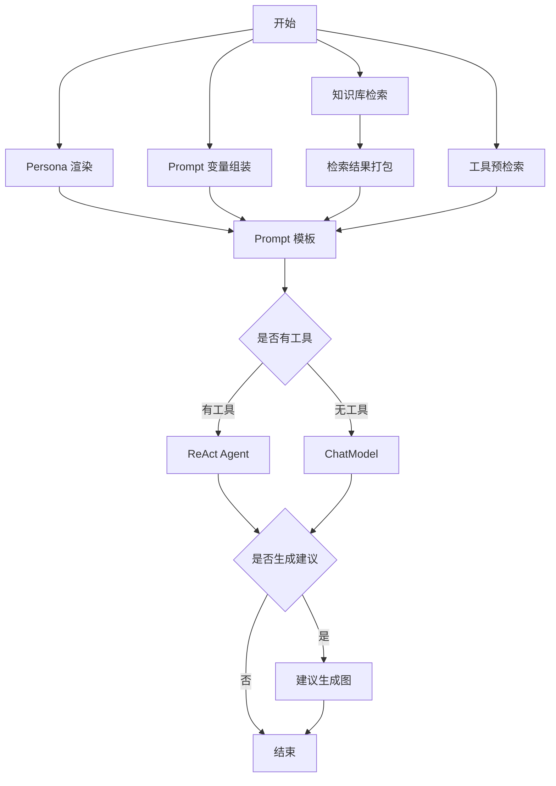
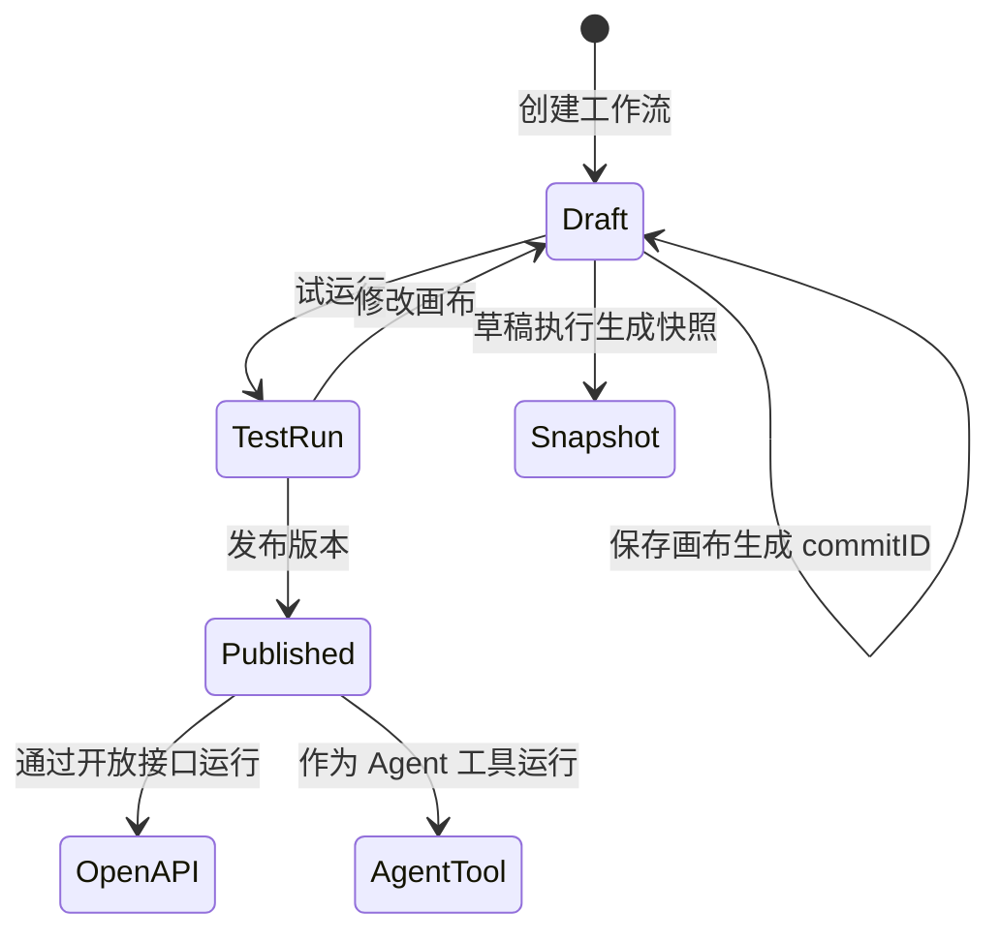
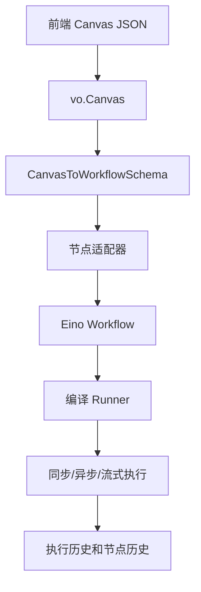
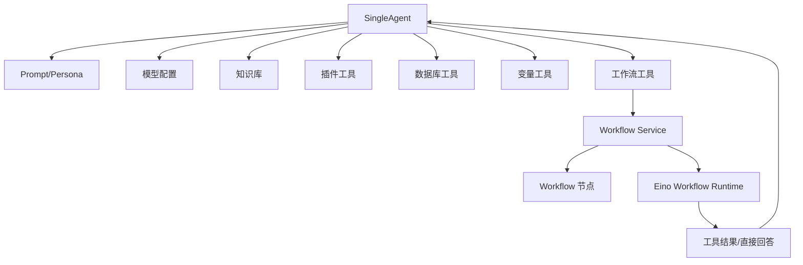

# 核心机制：Agent、Workflow 与资源编排

## 这是什么机制

**它是什么**：这是 Coze Studio 把智能体、工作流、插件、知识库、数据库、变量等资源组合成可运行 AI 应用的机制。

**为什么需要它**：一个有用的 AI Agent 不只是模型加 Prompt。它需要检索知识、调用插件、读写变量、执行工作流、访问数据库、管理会话和发布到不同连接器。资源编排机制让这些能力能以可视化和可配置方式组合。

**设计核心**：Agent 是资源聚合入口，Workflow 是可视化编排和可执行图，Plugin/Knowledge/Database/Variables 是可被 Agent 或 Workflow 调用的资源。

## Agent 机制

### SingleAgent 是什么

SingleAgent 是最基础的智能体类型，由单个智能体完成任务。领域接口覆盖：

- 草稿创建、查询、更新、删除。
- 发布版本创建和查询。
- 流式执行。
- 发布历史。
- 发布渠道列表。
- 弹窗计数。

### 为什么采用草稿/发布双版本

开发者在 IDE 中编辑的是草稿，线上调用的是发布版本。这样可以让未完成配置不影响线上使用，也能让不同 connector 绑定不同发布版本。

数据库中对应关系是：

- `single_agent_draft`：编辑态。
- `single_agent_version`：发布态版本副本。
- `single_agent_publish`：发布记录。
- `agent_tool_draft` / `agent_tool_version`：Agent 绑定工具的草稿和版本。
- `agent_to_database`：Agent 与数据库资源关系。

## AgentFlow 运行图

AgentFlow 使用 Eino graph 构建智能体执行链。

### 工具进入 ReAct 的条件

AgentFlow 会动态加载这些工具：

- 插件工具。
- 工作流工具。
- 数据库工具。
- 变量工具。

只要存在工具，就切换到 ReAct Agent，并要求模型支持 function call。这样设计的原因是工具调用需要模型能结构化选择工具和参数；普通 ChatModel 不一定具备这个能力。

### Workflow 如何成为 Agent 工具

Workflow 领域提供 `AsTool` 能力，AgentFlow 调用 `newWorkflowTools` 把工作流包装成可调用工具。部分工具可以设置为直接返回，适合把 workflow 输出作为最终回答。

## Workflow 机制

### Workflow 是什么

Workflow 是可视化画布和后端可执行图的组合。用户看到的是节点和连线，后端运行的是由画布转换出来的 WorkflowSchema，再由 Eino 编译为可执行 Runner。

### 为什么需要 Workflow

纯 Agent 适合自由对话，但很多业务需要固定步骤、条件分支、循环、批处理、数据库写入、HTTP 请求和多工具串联。Workflow 给这些逻辑一个可视化、可验证、可发布、可复用的表达方式。

## Workflow 生命周期

## 画布到执行的转换

## 节点系统

**它是什么**：节点是 workflow 的最小执行单元，每种节点有自己的元数据、画布配置、适配器和执行逻辑。

**为什么存在**：低代码画布的扩展能力来自节点。新增一个能力，不必重写整个执行引擎，只需要新增节点类型和适配器。

已注册节点包括：

- 基础节点：Entry、Exit、InputReceiver、OutputEmitter。
- 模型与工具：LLM、Plugin、CodeRunner、HTTPRequester。
- 知识库：KnowledgeIndexer、KnowledgeRetriever、KnowledgeDeleter。
- 数据库：DatabaseInsert、DatabaseUpdate、DatabaseQuery、DatabaseDelete、DatabaseCustomSQL。
- 控制流：Selector、IntentDetector、QuestionAnswer、Loop、Batch、Break、Continue。
- 变量与文本：VariableAggregator、VariableAssigner、VariableAssignerWithinLoop、TextProcessor。
- JSON：JsonSerialization、JsonDeserialization。
- 会话消息：CreateConversation、ConversationUpdate、ConversationDelete、ConversationList、ConversationHistory、ClearConversationHistory、MessageList、CreateMessage、EditMessage、DeleteMessage。
- 复用：SubWorkflow。

## Workflow 执行模式

Workflow 执行服务支持：

- 同步执行。
- 异步执行。
- 单节点调试。
- 流式执行。
- 中断恢复。
- 取消执行。

`SyncExecute` 的核心链路：

1. 获取 workflow entity。
2. 校验应用发布版本。
3. 反序列化画布。
4. 转换为 WorkflowSchema。
5. 创建 Eino Workflow。
6. 转换输入。
7. 准备 WorkflowRunner。
8. 执行并收集最后事件。
9. 组装 WorkflowExecution。

## 中断恢复与 checkpoint

**它是什么**：WorkflowRunner 在执行前准备 executeID、执行记录、事件通道、超时控制和 checkpoint。恢复时会根据 interrupt event 找到恢复位置，并生成 state modifier。

**为什么需要它**：工作流可能包含问答、人类输入、工具中断、长任务和嵌套子工作流。没有 checkpoint，就无法从中断点继续，只能重新执行整个流程。

恢复时的关键控制：

- 使用已有 executeID。
- 读取第一个 interrupt event。
- 校验 eventID。
- 根据 node path 区分顶层、复合节点和子工作流。
- 锁定 workflow execution，避免并发恢复。
- 更新中断数据。
- 启动事件处理 goroutine。

## Agent 与 Workflow 的关系

## 值得注意的设计

- AgentFlow 和 Workflow 都建立在 Eino 之上，但面向不同问题：AgentFlow 是智能体对话图，Workflow 是业务流程图。
- Workflow 可以独立运行，也可以作为 Agent 工具运行。
- ChatFlow 是 workflow 的一种模式，数据表 `workflow_meta.mode` 中可区分普通 workflow 和 chat_flow。
- Agent 配置里包含 workflow、plugin、knowledge、database、variables 等资源引用，运行时再转换为工具或上下文。

