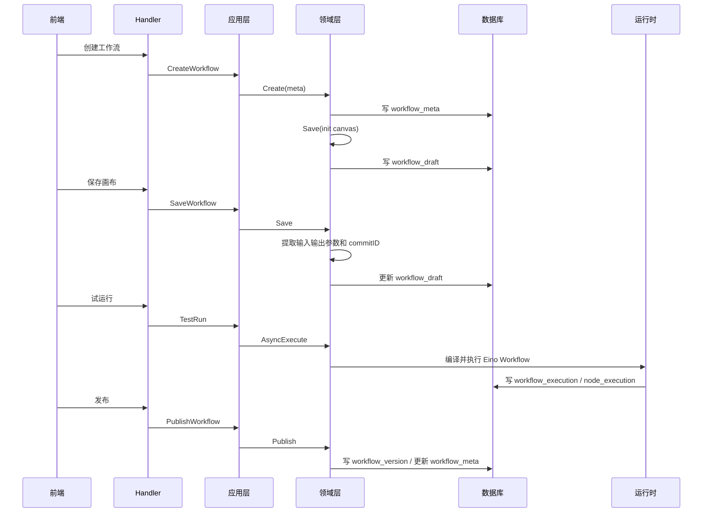
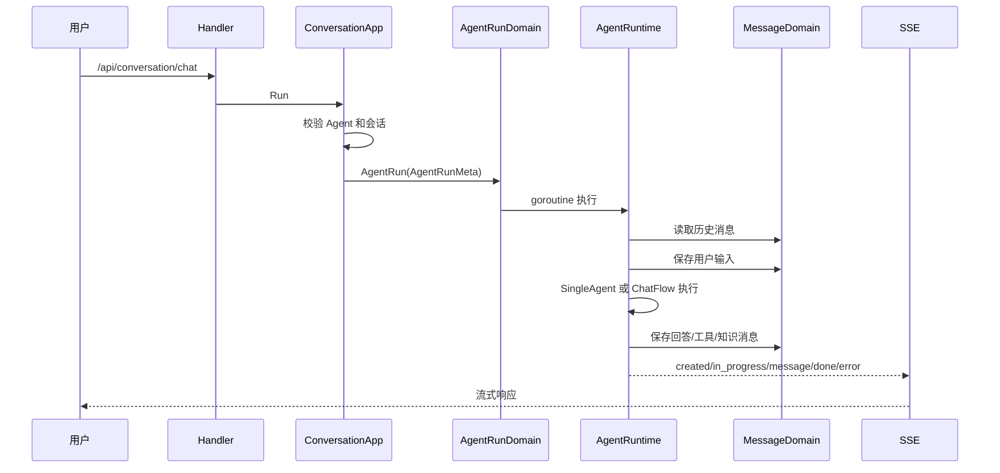

# 数据流与状态管理

## 核心数据结构

### 用户与空间

**它是什么**：用户、空间和空间成员关系是多租户边界。

**为什么这样建模**：平台中的 Agent、Workflow、Knowledge、Plugin、Database 都需要归属空间。空间让个人和团队资源隔离，也为权限扩展留下位置。

**主要表**：

- `user`：用户账号、邮箱、加密密码、头像、语言、session key。
- `space`：空间元数据。
- `space_user`：用户与空间角色关系。

### Agent

**它是什么**：智能体配置，包含模型、Prompt、插件、知识库、工作流、数据库、变量、快捷命令等。

**为什么这样建模**：Agent 有编辑态和发布态。编辑态可以频繁变化，发布态需要稳定供 connector 或 OpenAPI 使用。

**主要表**：

- `single_agent_draft`：草稿态智能体。
- `single_agent_version`：发布版本副本。
- `single_agent_publish`：发布记录。
- `agent_tool_draft`、`agent_tool_version`：Agent 工具绑定。
- `agent_to_database`：Agent 与数据库资源绑定。

### Workflow

**它是什么**：可视化编排对象和可执行对象。

**为什么这样建模**：Workflow 既有元数据，也有前端画布、发布版本、执行历史、快照和引用关系。拆表可以让编辑、发布、执行互不干扰。

**主要表**：

- `workflow_meta`：名称、描述、空间、状态、模式、最新版本。
- `workflow_draft`：最新草稿 canvas、输入输出参数、测试状态、commitID。
- `workflow_version`：发布版本 canvas 和 commitID。
- `workflow_snapshot`：草稿执行时的 commitID 快照。
- `workflow_execution`：执行记录。
- `workflow_reference`：workflow 被子工作流或工具引用的关系。
- `connector_workflow_version`：应用发布到 connector 时绑定的 workflow 版本。
- `chat_flow_role_config`：ChatFlow 角色配置。

### 知识库

**它是什么**：RAG 资源，管理知识库、文档、切片、审核和索引。

**为什么这样建模**：知识库不是一个文件，而是一组文档和切片，并且需要异步解析、向量化、索引、审核和检索。

**主要表**：

- `knowledge`：知识库元数据。
- `knowledge_document`：文档元数据和解析状态。
- `knowledge_document_slice`：文档切片。
- `knowledge_document_review`：文档审核。

向量和全文检索不只在 MySQL 中完成，还依赖 Milvus、Elasticsearch 和对象存储。

### 插件与工具

**它是什么**：外部 API 能力的抽象。Plugin 是工具集合，Tool 是具体 OpenAPI operation。

**为什么这样建模**：插件开发需要草稿调试和版本发布，Agent 使用工具时也要绑定稳定版本。

**主要表**：

- `plugin`、`plugin_draft`、`plugin_version`。
- `tool`、`tool_draft`、`tool_version`。
- `plugin_oauth_auth`：插件 OAuth 授权信息。

### 变量与数据库资源

**它是什么**：Agent 或 App 的记忆变量，以及平台内可被工作流或智能体调用的数据库表。

**为什么这样建模**：变量需要区分业务对象、版本、connector 用户；数据库资源需要区分草稿和线上。

**主要表**：

- `variables_meta`：变量配置，`biz_type` 区分 agent 和 app，空 version 表示草稿。
- `variable_instance`：具体用户或 connector 下的变量值。
- `draft_database_info`、`online_database_info`：数据库资源草稿和线上信息。
- `kv_entries`：键值资源。

### 会话与消息

**它是什么**：用户和 Agent 交互的运行记录。

**为什么这样建模**：会话用于聚合多轮消息，run record 用于记录一次 Agent 执行，message 表保存输入、回答、工具、知识等消息片段。

**主要表**：

- `conversation`。
- `message`。
- `run_record`。
- `node_execution`。

## Workflow 数据生命周期

## Agent 对话数据生命周期

## 状态管理

### 后端状态

后端状态主要分三类：

- 持久化状态：MySQL/OceanBase 中的业务表。
- 运行状态：Redis 中的 session、checkpoint、锁和缓存。
- 检索状态：Elasticsearch 和 Milvus 中的索引与向量。

### 前端状态

前端状态分散在业务包中：

- `foundation/global-store` 和 `space-store` 管全局与空间状态。
- `agent-ide/bot-editor-context-store` 管智能体编辑器上下文。
- `workflow/history`、`workflow/variable`、`workflow/playground` 管工作流画布、历史、变量和试运行。

主应用壳只负责路由和挂载，不直接承载复杂业务状态。

## 并发与一致性

### commitID

Workflow 每次保存草稿都会生成 commitID。它用于连接：

- `workflow_draft` 的当前草稿。
- `workflow_snapshot` 的执行快照。
- `workflow_version` 的发布版本。
- `workflow_execution` 的执行记录。

这解决了一个关键问题：用户继续编辑草稿时，已经发起的执行仍能知道自己对应的是哪一次草稿内容。

### 执行锁与中断恢复

Workflow 恢复执行时会通过 repository 锁定 execution，防止多个恢复请求同时修改同一条执行状态。中断事件的 node path 用于定位顶层节点、复合节点或子工作流内部恢复点。

### 事件最终一致性

资源、应用、知识库的搜索索引更新通过 EventBus 异步完成。这让主流程不用等待索引写入，但也意味着搜索结果和 MySQL 主数据之间存在短暂最终一致性窗口。

## 待继续确认

- `node_execution` 与 `workflow_execution` 的完整写入链路。
- Milvus collection 和知识库切片之间的精确映射。
- Elasticsearch 中 `project_draft`、`coze_resource` 索引与 MySQL 资源表的同步规则。

