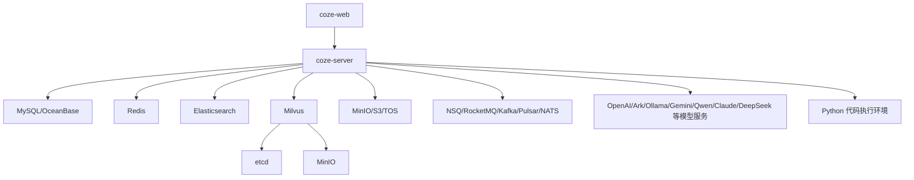

# 依赖与生态

## 核心依赖

### Hertz

**它是什么**：Go HTTP 框架。

**为什么选择它**：项目需要高性能 HTTP API、生成路由、中间件链、静态资源托管和 SSE。Hertz 与 CloudWeGo 生态结合紧密，也适合 IDL 生成路由。

**项目中的角色**：`backend/main.go` 创建 Hertz server，`backend/api/router` 注册生成路由，handler 使用 Hertz request context 绑定请求和返回响应。

### Eino

**它是什么**：CloudWeGo 的 AI 应用开发框架，提供模型、工具、compose 图、stream、checkpoint 等能力。

**为什么选择它**：Coze Studio 的核心是 Agent 和 Workflow 运行时。Eino 提供图编排、ReAct Agent、工具调用、流式输出和 checkpoint，能同时支撑 AgentFlow 和 Workflow runtime。

**项目中的角色**：

- AgentFlow 使用 Eino graph 和 ReAct Agent。
- Workflow 使用 Eino compose.Workflow 编译可执行图。
- OpenAPI 和对话流式输出使用 Eino StreamReader。
- checkpoint 用于 workflow 中断恢复和工具调用。

### GORM

**它是什么**：Go ORM。

**为什么选择它**：后端领域数据表很多，GORM 能降低 CRUD、事务和软删除处理成本。

**项目中的角色**：`backend/infra/orm/impl/mysql` 初始化数据库连接，领域 repository 使用 GORM 访问 MySQL/OceanBase。

### Redis

**它是什么**：内存缓存和键值存储。

**为什么选择它**：系统需要 session、缓存、ID 生成辅助、checkpoint、锁和执行状态等低延迟状态。

**项目中的角色**：`CacheCli` 被 user、workflow、agent、memory 等服务使用，workflow checkpoint 通过 Redis store 提供。

### Elasticsearch

**它是什么**：搜索引擎。

**为什么选择它**：平台资源搜索和项目草稿搜索需要全文检索和索引能力。

**项目中的角色**：Docker 初始化 smartcn analyzer，并应用 index schema。后端 `infra/es` 提供客户端，search 应用服务接收资源事件更新索引。

### Milvus

**它是什么**：向量数据库。

**为什么选择它**：知识库检索需要向量召回，关系型数据库不适合高维向量相似度搜索。

**项目中的角色**：Docker 中 Milvus 依赖 etcd 和 MinIO，知识库 searchstore 通过 Milvus 管理向量检索。

### MinIO / S3 / TOS

**它是什么**：对象存储。

**为什么选择它**：平台需要保存头像、图标、文件、知识库文档、插件图标和上传资源。对象存储能把大文件从关系数据库中剥离。

**项目中的角色**：`infra/storage` 支持 minio、s3、tos，多数文件 URL 和 URI 都通过该层处理。

### EventBus

**它是什么**：异步消息总线抽象。

**为什么选择它**：资源变更、搜索索引、知识库构建等任务不应阻塞用户请求。事件总线让主流程和异步处理解耦。

**项目中的角色**：接口层定义 Producer 和 ConsumerService，实现支持 nsq、kafka、rmq、pulsar、nats。生产者由 `MQ_TYPE` 和 `MQ_SERVER` 等环境变量选择。

## 前端依赖

### Rush 和 pnpm

**它是什么**：大型 TypeScript monorepo 的工程管理工具。

**为什么选择它**：前端包数量很大，按 foundation、arch、agent-ide、workflow、project-ide 等业务边界拆分。Rush 能管理包依赖、构建顺序和统一脚本。

**项目中的角色**：`rush.json` 管理 workspace 包，要求 Rush 5.147.1、pnpm 8.15.8、Node >=21。

### React 和 React Router

**它是什么**：前端 UI 和路由框架。

**为什么选择它**：Coze Studio 是复杂交互式 Web 应用，React 适合组件化工作台，React Router 承载空间、Agent IDE、Project IDE、Workflow、Explore 等路由。

**项目中的角色**：主应用使用 `RouterProvider`，页面由懒加载组件导入各业务包。

### Rsbuild / Rspack

**它是什么**：前端构建工具。

**为什么选择它**：大型前端 monorepo 对构建速度和插件能力要求较高。

**项目中的角色**：`frontend/apps/coze-studio/package.json` 中 `build` 和 `dev` 使用 rsbuild。

### Zustand

**它是什么**：轻量前端状态管理库。

**为什么选择它**：比全局大 store 更轻，适合业务包内部维护编辑器、空间、画布等状态。

**项目中的角色**：作为前端包的状态管理依赖。

### FlowGram

**它是什么**：工作流画布搭建引擎。

**为什么选择它**：Coze Studio 需要可视化拖拽、节点连线、画布交互和渲染能力。FlowGram 负责前端画布编辑体验。

**项目中的角色**：前端 `@flowgram-adapter/*` 和 `frontend/packages/workflow` 共同支撑工作流画布。

## 外部系统集成

## 部署生态

Docker Compose 默认包含：

- MySQL 8.4.5。
- Redis 8。
- Elasticsearch 8.18.0。
- MinIO。
- etcd。
- Milvus 2.5.10。
- NSQ。
- coze-server。
- coze-web。

Helm chart 额外覆盖：

- RocketMQ namesrv/broker。
- OceanBase。
- Kubernetes Service、Deployment、StatefulSet、ConfigMap、Secret、初始化 Job。

## 项目定位

**在同类工具中的位置**：Coze Studio 更像完整 AI Agent 开发平台，不只是聊天 UI 或 workflow runner。它的优势是前后端、运行时、资源管理和部署方案齐全；代价是工程复杂度高，二次开发者需要理解多层抽象。

**有意分离的能力**：

- 前端画布和后端执行分离：前端负责体验，后端负责编译和运行。
- 草稿和发布分离：保护线上稳定性。
- 基础设施接口和实现分离：支持本地、云服务和不同消息队列。
- OpenAPI 与 Web API 鉴权分离：分别服务外部开发者和 Web 用户。

## 需要注意的依赖差异

- EventBus 代码注释提到 RocketMQ 默认，但 Docker Compose 默认启动 NSQ，实际由环境变量决定。
- README 中提到可接 OpenAI、火山方舟等模型，`go.mod` 还出现 Claude、Gemini、Ollama、Qwen、DeepSeek 等模型适配。
- Helm 中同时提供 MySQL 和 OceanBase 模板，说明数据库层有兼容演进需求。

