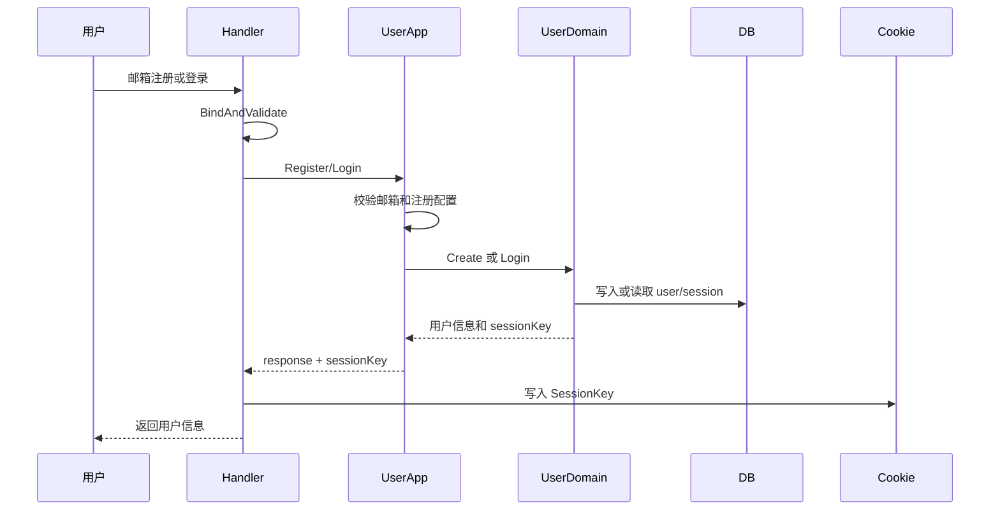
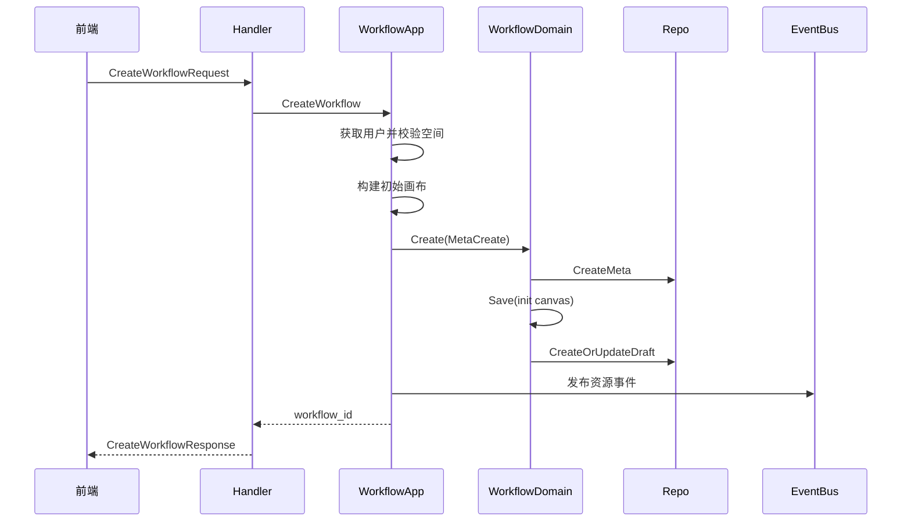
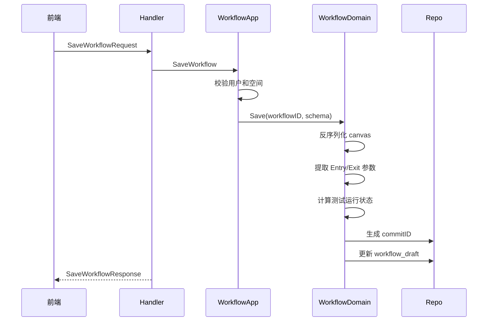
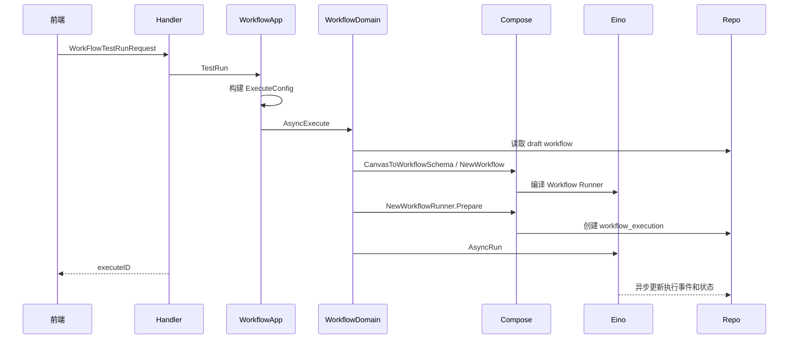
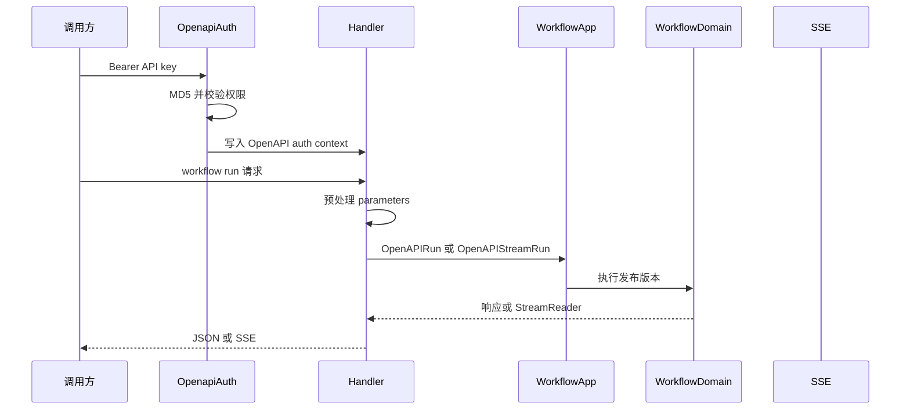
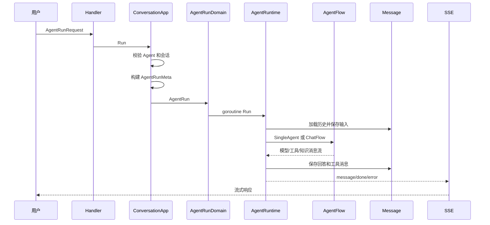
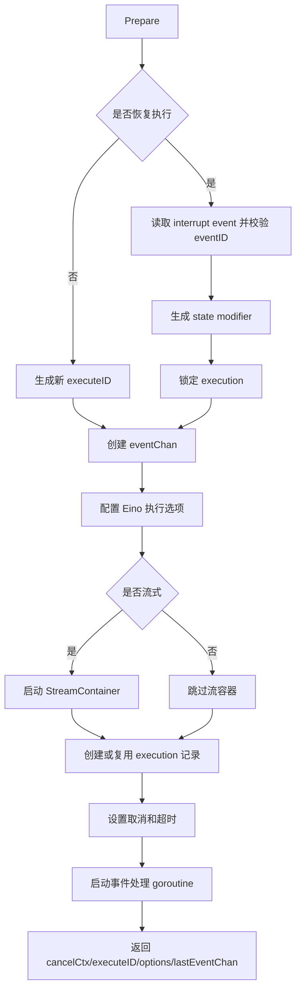
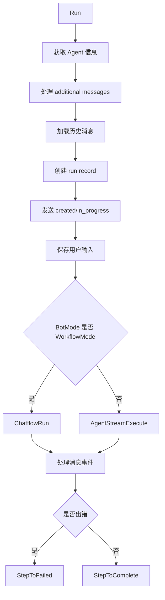

# 核心工作流

## 端到端业务流程

### 用户注册与登录

**它是什么**：用户通过邮箱注册或登录 Web 平台，后端写入 session cookie，后续 Web API 通过 SessionAuth 校验登录态。

**触发方式**：前端 `/sign` 页面调用 passport API。

**关键步骤说明**：

| 步骤 | 负责模块 | 做什么 | 为什么在这一步 |
| --- | --- | --- | --- |
| 1 | passport handler | 绑定请求并调用用户应用服务 | handler 只处理 HTTP 边界 |
| 2 | user application | 校验邮箱、注册开关和允许邮箱 | 注册策略属于应用用例 |
| 3 | user domain | 创建用户或校验登录 | 账号规则属于用户领域 |
| 4 | handler | 写 session cookie | HTTP cookie 是传输层行为 |
| 5 | SessionAuth | 后续请求校验 cookie | 保持 Web API 登录态 |

### 创建工作流

**它是什么**：用户在空间中创建一个普通 Workflow 或 ChatFlow，系统写入元数据和初始草稿画布。

**触发方式**：前端调用 `/api/workflow_api/create`。

**关键步骤说明**：

| 步骤 | 负责模块 | 做什么 | 为什么在这一步 |
| --- | --- | --- | --- |
| 1 | application/workflow | 校验用户和空间 | 多租户资源必须归属空间 |
| 2 | application/workflow | 根据模式生成默认画布 | 普通 Workflow 和 ChatFlow 初始模板不同 |
| 3 | domain/workflow | 创建 meta 后保存 draft | 生命周期起点同时需要元数据和画布 |
| 4 | repository | 写 `workflow_meta` 和 `workflow_draft` | 保证可查询和可编辑 |
| 5 | search event | 异步更新资源索引 | 搜索不阻塞创建主流程 |

### 保存工作流画布

**它是什么**：用户编辑画布后保存，系统更新草稿 canvas、输入输出参数、测试状态和 commitID。

**触发方式**：前端调用 `/api/workflow_api/save`。

**关键步骤说明**：

| 步骤 | 负责模块 | 做什么 | 为什么在这一步 |
| --- | --- | --- | --- |
| 1 | domain/workflow | 解析 canvas | 后端需要理解画布结构 |
| 2 | domain/workflow | 提取输入输出参数 | OpenAPI、发布和工具化需要参数定义 |
| 3 | domain/workflow | 计算测试状态 | 画布逻辑改变后需要重新测试 |
| 4 | repository | 写 commitID | 让执行、快照、发布能绑定具体草稿 |

### 工作流试运行

**它是什么**：用户在编辑态试运行 workflow，API 立即返回 executeID，后端异步执行并记录过程。

**触发方式**：前端调用 `/api/workflow_api/test_run`。

**关键步骤说明**：

| 步骤 | 负责模块 | 做什么 | 为什么在这一步 |
| --- | --- | --- | --- |
| 1 | application/workflow | 构建 Debug/Draft/Async 配置 | 试运行不应影响发布态 |
| 2 | domain/workflow | 画布转 WorkflowSchema | 执行引擎不直接吃前端 canvas |
| 3 | compose | 编译 Eino Workflow | 获得可执行 Runner |
| 4 | WorkflowRunner | 创建 execution 和事件处理 | 支撑查询进度、中断和失败记录 |
| 5 | Eino | 异步执行节点图 | API 可以快速返回 executeID |

### OpenAPI 运行工作流

**它是什么**：外部开发者用 API key 调用发布后的 workflow，同步或流式获取执行结果。

**触发方式**：`/v1/workflow/run`、`/v1/workflow/stream_run`、`/v1/workflows/chat`。

**关键步骤说明**：

| 步骤 | 负责模块 | 做什么 | 为什么在这一步 |
| --- | --- | --- | --- |
| 1 | OpenapiAuth | 校验 Bearer API key | 外部 API 不使用 Web cookie |
| 2 | handler | 预处理 parameters | 兼容对象参数和字符串参数 |
| 3 | application/workflow | 根据 OpenAPI 上下文构造执行配置 | 需要 connector、用户和发布态信息 |
| 4 | handler | SSE 转换 | HTTP 层负责流式协议输出 |

### Agent 对话运行

**它是什么**：用户在 Web 端和 Agent 对话，后端创建或校验会话，运行 AgentFlow 或 ChatFlow，并通过 SSE 返回消息 chunk。

**触发方式**：`/api/conversation/chat` 或 `/v3/chat`。

**关键步骤说明**：

| 步骤 | 负责模块 | 做什么 | 为什么在这一步 |
| --- | --- | --- | --- |
| 1 | ConversationApp | 校验 Agent 和会话归属 | 防止跨用户会话访问 |
| 2 | ConversationApp | 解析多模态输入 | AgentFlow 需要结构化输入 |
| 3 | AgentRunDomain | 创建 StreamReader/Writer | 分离运行和 HTTP SSE 输出 |
| 4 | AgentRuntime | 加载历史、创建 run record | 多轮对话和运行审计需要 |
| 5 | AgentFlow | 模型、工具、知识库执行 | 真正生成回复 |
| 6 | MessageDomain | 保存消息 | 支持历史、重试、审计和前端展示 |

## 模块内部执行流程

### WorkflowRunner 内部流程

### AgentRuntime 内部流程

## 异常分支

| 异常场景 | 触发条件 | 处理方式 | 对用户的影响 |
| --- | --- | --- | --- |
| Web API 缺少 session | 非登录注册 Web API 没有 cookie | SessionAuth 返回未授权 | 页面需要登录或请求失败 |
| OpenAPI key 无效 | Bearer 缺失、格式错误或校验失败 | OpenapiAuth 返回鉴权错误 | API 调用失败 |
| Workflow 参数无法绑定 | 请求结构不符合 IDL 模型 | handler 返回 invalid param | 前端或调用方看到参数错误 |
| Workflow 运行业务错误 | 抛出 `vo.WorkflowError` | OpenAPI 返回业务错误码和可能的 debug URL | 调用方可定位失败节点 |
| Agent 运行出错 | AgentRuntime 或下游工具出错 | SSE 发送 error 或错误消息 chunk | 聊天流中出现错误提示 |
| 中断恢复并发冲突 | 同一 execution 被多个恢复请求操作 | TryLockWorkflowExecution 失败 | 恢复请求失败，需要重试或刷新状态 |

